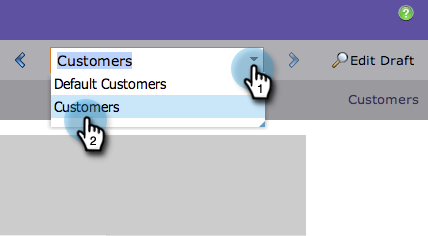

# Previsualización de una página de destino con contenido dinámico {#preview-a-landing-page-with-dynamic-content}

Obtenga una vista previa de la página de aterrizaje después de agregar contenido dinámico para asegurarse de que todo tiene el aspecto que debería.

>[!PREREQUISITES]
>
>* [Usar contenido dinámico en una página de aterrizaje](/help/marketo/product-docs/demand-generation/landing-pages/personalizing-landing-pages/use-dynamic-content-in-a-landing-page.md)
>* [Vista previa de una página de aterrizaje](/help/marketo/product-docs/demand-generation/landing-pages/landing-page-actions/preview-a-landing-page.md)

1. Seleccione una página de aterrizaje y haga clic en **[!UICONTROL Previsualizar página]**.

   

1. Haga clic en la lista desplegable y seleccione un **segmento** para previsualizarlo.

   

Ahora puede asegurarse de que las páginas de aterrizaje funcionen del modo que desea en todos los segmentos.
