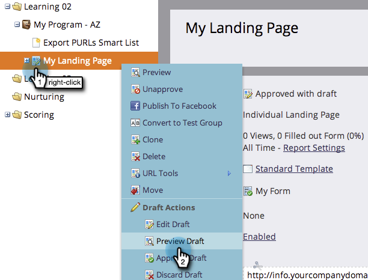

# Previsualización de la página de destino {#preview-a-landing-page}

Obtenga una vista previa de la página de aterrizaje para ver su aspecto antes de publicarla.

## Previsualización de la página de destino {#preview-a-landing-page-1}

1. Seleccione una página de aterrizaje y haga clic en **[!UICONTROL Previsualizar página]**.

   

   >[!NOTE]
   >
   >El borrador es la versión en la que está trabajando, no la versión activa que ven los clientes.

1. También puede hacer clic con el botón derecho en la página de aterrizaje y seleccionar **[!UICONTROL Vista previa]**.

   

## Previsualizar un borrador de página de aterrizaje {#preview-a-landing-page-draft}

1. Haga clic con el botón derecho en una página de aterrizaje aprobada que tenga una versión de borrador y haga clic en **[!UICONTROL Previsualizar borrador]**.

   

## Previsualización de un borrador de página de aterrizaje al editar {#preview-a-landing-page-draft-while-editing}

1. Seleccione una página de aterrizaje y haga clic en **[!UICONTROL Editar borrador]**.

   

1. En cualquier momento del trabajo en el editor de páginas de aterrizaje, puedes hacer clic en **[!UICONTROL Previsualizar borrador]**.

   

1. Para volver rápidamente a la edición, haga clic en **[!UICONTROL Editar borrador]**.

   

Ahora sabe cómo previsualizar las páginas de aterrizaje.
