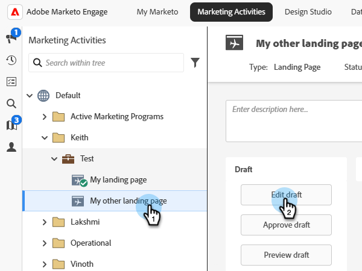

# Previsualización de la página de destino {#preview-a-landing-page}

Obtenga una vista previa de la página de aterrizaje para ver su aspecto antes de publicarla.

>[!IMPORTANT]
>
>Algunas metaetiquetas personalizadas no son compatibles con el modo de vista previa (como la directiva de redireccionamiento `<meta http-equiv="refresh" ...>`), ya que pueden infringir la Política de seguridad de contenido establecida para mantener Marketo Engage seguro. Para obtener una vista previa de las páginas de aterrizaje con estas etiquetas, genere la dirección URL de vista previa (**Acciones de vista previa** > **Generar URL de vista previa**) y péguela en una nueva ventana del explorador.

## Previsualización de una página aprobada {#preview-approved-page}

1. Seleccione la página de aterrizaje que desee y haga clic en **[!UICONTROL Vista previa]**.

   

También puede hacer clic con el botón derecho en la página de aterrizaje y seleccionar **[!UICONTROL Vista previa]**.

## Previsualización de un borrador {#preview-a-draft}

1. Seleccione la página de aterrizaje que desee y haga clic en **[!UICONTROL Previsualizar borrador]**.

   

>[!NOTE]
>
>El borrador es la versión en la que está trabajando, no la versión activa que ven los clientes.

## Previsualizar un borrador de página de aterrizaje al editar {#preview-a-draft-while-editing}

1. Seleccione la página de aterrizaje deseada y haga clic en **[!UICONTROL Editar borrador]**.

   

1. En el editor de la página de aterrizaje, haga clic en **[!UICONTROL Previsualizar borrador]**.

   

1. Vuelva a la edición haciendo clic en **[!UICONTROL Editar borrador]**.

   
