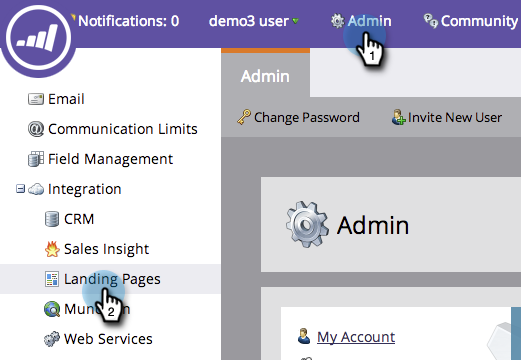
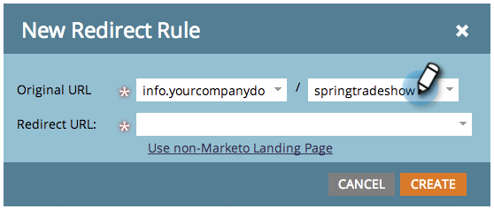

# Redireccionar una página de aterrizaje de Marketo a otra página {#redirect-a-marketo-landing-page-to-another-page}

Si alguna vez actualiza la dirección URL de una página y desea que la dirección URL antigua siga funcionando, pruebe con un redireccionamiento. La configuración es fácil.

>[!NOTE]
>
>**Se requieren permisos de administrador**

1. En **Administrador**, haga clic en **Páginas de aterrizaje**.

   

1. En el **Reglas** , haga clic en **Nuevo** y luego **Nueva regla de redirección**.

   

1. Haga clic en la primera **URL original** y seleccione su Marketo [CNAME](/help/marketo/product-docs/demand-generation/landing-pages/landing-page-actions/customize-your-landing-page-urls-with-a-cname.md).

   

   >[!NOTE]
   >
   >Recuerde, solo puede redirigir las direcciones URL que empiecen por Marketo [CNAME](/help/marketo/product-docs/demand-generation/landing-pages/landing-page-actions/customize-your-landing-page-urls-with-a-cname.md).

1. Elija la página de aterrizaje que desee redirigir en el segundo **URL original** campo .

   

   >[!NOTE]
   >
   >Puede introducir cualquier ruta de URL, incluso si la página o el directorio no existen.

1. Haga clic en el **Dirección URL de redireccionamiento** y seleccione la página a la que desee redirigir a los visitantes.

   

1. Haga clic en **Crear**.

   

   >[!TIP]
   >
   >Para redirigir a una página web fuera de Marketo, haga clic en **Usar página de aterrizaje que no sea de Marketo**.

   >[!MORELIKETHIS]
   >
   >[Redireccionar una ruta de URL](/help/marketo/product-docs/demand-generation/landing-pages/personalizing-landing-pages/redirect-a-url-path.md)
