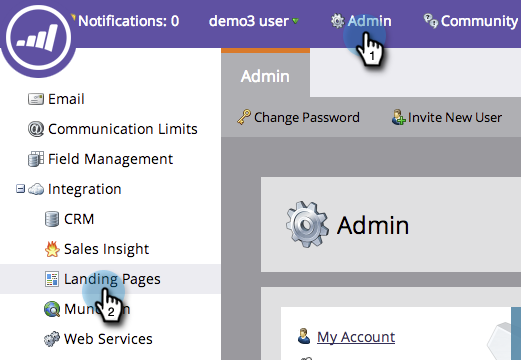
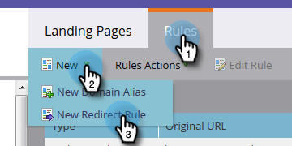

# Redirigir una página de destino de Marketo a otra página {#redirect-a-marketo-landing-page-to-another-page}

Si alguna vez actualiza la dirección URL de una página y desea que la dirección URL antigua siga funcionando, intente una redirección. Configurarlo es fácil.

>[!NOTE]
>
>**Se requieren permisos de administrador**

1. En **[!UICONTROL Administrador]**, haga clic en **[!UICONTROL Páginas de aterrizaje]**.

   

1. En la ficha **[!UICONTROL Reglas]**, haga clic en **[!UICONTROL Nueva]** y, a continuación, en **[!UICONTROL Nueva regla de redireccionamiento]**.

   

1. Haga clic en el primer menú desplegable de **[!UICONTROL URL original]** y seleccione su [CNAME](/help/marketo/product-docs/demand-generation/landing-pages/landing-page-actions/customize-your-landing-page-urls-with-a-cname.md) de Marketo.

   

   >[!NOTE]
   >
   >Recuerde, solo puede redirigir direcciones URL que comiencen con su Marketo [CNAME](/help/marketo/product-docs/demand-generation/landing-pages/landing-page-actions/customize-your-landing-page-urls-with-a-cname.md).

1. Elija la página de aterrizaje que quiera redirigir en el segundo campo **[!UICONTROL URL original]**.

   

   >[!NOTE]
   >
   >Puede introducir cualquier ruta de URL, incluso si la página o el directorio no existen.

1. Haga clic en el menú desplegable **[!UICONTROL URL de redireccionamiento]** y seleccione la página a la que desee redirigir a los visitantes.

   

1. Haga clic en **[!UICONTROL Crear]**.

   

   >[!TIP]
   >
   >Para redirigir a una página web fuera de Marketo, haga clic en **[!UICONTROL Usar página de aterrizaje que no sea de Marketo]**.

   >[!MORELIKETHIS]
   >
   >[Redirigir una ruta de acceso de dirección URL](/help/marketo/product-docs/demand-generation/landing-pages/personalizing-landing-pages/redirect-a-url-path.md)
