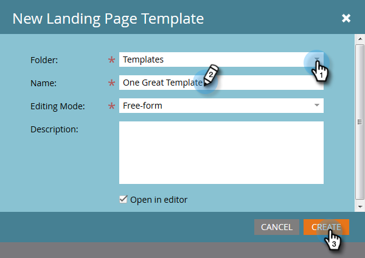

# Creación de una plantilla de la página de destino de forma libre {#create-a-free-form-landing-page-template}

Las páginas de aterrizaje de forma libre requieren menos conocimientos técnicos que sus homólogas guiadas. Para crear una plantilla para futuras páginas de aterrizaje, siga los pasos a continuación.

1. Vaya a **[!UICONTROL Design Studio]**.

   

1. Haga clic en **[!UICONTROL Nueva]** y, a continuación, seleccione **[!UICONTROL Nueva plantilla de página de aterrizaje]**.

   

1. Elija la carpeta y, a continuación, asigne un nombre a la plantilla. La forma libre es el modo de edición predeterminado, así que después de asignar un nombre a la plantilla, haga clic en **[!UICONTROL Crear]**.

   

1. La plantilla debe abrirse en una nueva pestaña. Ahora es editable por cualquier persona familiarizada con CSS/HTML.

   

   >[!NOTE]
   >
   >La asistencia de Marketo no está configurada para ayudar a solucionar problemas de HTML personalizado. Para obtener ayuda de HTML, consulte con un desarrollador web.

1. Cuando haya terminado de hacer cambios, haga clic en **[!UICONTROL Acciones de plantilla]** y, a continuación, seleccione **[!UICONTROL Aprobar y cerrar]**.

   

   >[!NOTE]
   >
   >Seleccione **[!UICONTROL Deshabilitar el seguimiento de Munchkin]** si desea evitar que los formularios se rellenen previamente o simplemente no desea realizar el seguimiento del comportamiento web en una página específica.
   >Seleccione **[!UICONTROL Validar compatibilidad móvil]** para asegurarse de que su código sea compatible con dispositivos móviles.

   >[!MORELIKETHIS]
   >
   >* [Crear una página de aterrizaje de forma libre](/help/marketo/product-docs/demand-generation/landing-pages/free-form-landing-pages/create-a-free-form-landing-page.md)
   >* [Crear una plantilla de página de aterrizaje guiada](/help/marketo/product-docs/demand-generation/landing-pages/landing-page-templates/create-a-guided-landing-page-template.md)
   >* [Explicación de las páginas de aterrizaje de forma libre y guiadas](/help/marketo/product-docs/demand-generation/landing-pages/understanding-landing-pages/understanding-free-form-vs-guided-landing-pages.md)
