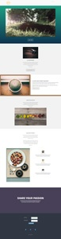

# Lista de plantillas de página de aterrizaje guiada {#guided-landing-page-template-list}

Examine nuestra colección de plantillas de ejemplo para usarlas con el [Editor de páginas de aterrizaje guiado](/help/marketo/product-docs/demand-generation/landing-pages/guided-landing-pages/create-a-guided-landing-page.md). Cada plantilla es totalmente adaptable y está basada en el marco del Bootstrap.

>[!NOTE]
>
>La compatibilidad con Marketo no está configurada para ayudar a solucionar problemas con HTML. Si necesita ayuda para modificar cualquiera de estas plantillas, consulte a un desarrollador web.

Para importar una plantilla en Marketo:

1. Haga clic en el nombre de la plantilla para obtener una vista más grande.
1. Descargue la plantilla elegida.
1. En Marketo, vaya a **Design Studio.**
1. Haga clic en **Páginas de aterrizaje** en el árbol de la izquierda y, a continuación, seleccione **Plantillas.**

1. En la barra de menús, haga clic en **Importar plantilla.**
1. Elija el archivo descargado, introduzca un nombre de plantilla y haga clic en **Importar** (asegúrese de elegir un nombre descriptivo e indicar que el modo de edición es **Guided**).

|  |  |  |
|---|---|---|
| [Plantilla 1A](guided-landing-page-templates/template-1a.md) | [Plantilla 1B](guided-landing-page-templates/template-1b.md) | [Plantilla 1C](guided-landing-page-templates/template-1c.md) |
|  |  |  |
| [Plantilla 1D](guided-landing-page-templates/template-1d.md) | [Plantilla 1E](guided-landing-page-templates/template-1e.md) | [Plantilla 1F](guided-landing-page-templates/template-1f.md) |
|  |  |  |
| [Plantilla 2A](guided-landing-page-templates/template-2a.md) | [Plantilla 2B](guided-landing-page-templates/template-2b.md) | [Plantilla 2C](guided-landing-page-templates/template-2c.md) |
|  |  |  |
| [Plantilla 2D](guided-landing-page-templates/template-2d.md) | [Plantilla 3A](guided-landing-page-templates/template-3a.md) | [Plantilla 3B](guided-landing-page-templates/template-3b.md) |
|  |  |  |
| [Plantilla 3C](guided-landing-page-templates/template-3c.md) | [Plantilla 3D](guided-landing-page-templates/template-3d.md) | [Plantilla 4A](guided-landing-page-templates/template-4a.md) |
|  |  |  |
| [Plantilla 4B](guided-landing-page-templates/template-4b.md) | [Plantilla 4C](guided-landing-page-templates/template-4c.md) | [Plantilla 5A](guided-landing-page-templates/template-5a.md) |
|  |  |  |
| [Plantilla 5B](guided-landing-page-templates/template-5b.md) | [Plantilla 5C](guided-landing-page-templates/template-5c.md) | [Plantilla 5D](guided-landing-page-templates/template-5d.md) |
|  |  |  |
| [Plantilla 5E](guided-landing-page-templates/template-5e.md) | [Plantilla 6A](guided-landing-page-templates/template-6a.md) | [Plantilla 6B](guided-landing-page-templates/template-6b.md) |
|  |  |  |
| [Plantilla 6C](guided-landing-page-templates/template-6c.md) | [Plantilla 6D](guided-landing-page-templates/template-6d.md) | [Plantilla 6E](guided-landing-page-templates/template-6e.md) |
|  |  |  |
| [Plantilla 7A](guided-landing-page-templates/template-7a.md) | [Plantilla 7B](guided-landing-page-templates/template-7b.md) | [Plantilla 7C](guided-landing-page-templates/template-7c.md) |
|  |  |  |
| [Plantilla 7D](guided-landing-page-templates/template-7d.md) | [Plantilla 7E](guided-landing-page-templates/template-7e.md) | [Plantilla 7F](guided-landing-page-templates/template-7f.md) |
|  |  |  |
| [Plantilla 8A](guided-landing-page-templates/template-8a.md) | [Plantilla 8B](guided-landing-page-templates/template-8b.md) | [Plantilla 8C](guided-landing-page-templates/template-8c.md) |
|  |  |  |
| [Plantilla 8D](guided-landing-page-templates/template-8d.md) | [Plantilla 8E](guided-landing-page-templates/template-8e.md) | [Plantilla 8F](guided-landing-page-templates/template-8f.md) |
|  |  |  |
| [Plantilla 8G](guided-landing-page-templates/template-8g.md) | [Plantilla 9A](guided-landing-page-templates/template-9a.md) | [Plantilla 9B](guided-landing-page-templates/template-9b.md) |
|  |  |  |
| [Plantilla 9C](guided-landing-page-templates/template-9c.md) | [Plantilla 9D](guided-landing-page-templates/template-9d.md) | [Plantilla 9E](guided-landing-page-templates/template-9e.md) |
|  |  |  |
| [Plantilla 9F](guided-landing-page-templates/template-9f.md) | [Plantilla 10A](guided-landing-page-templates/template-10a.md) | [Plantilla 10B](guided-landing-page-templates/template-10b.md) |
|  |  |  |
| [Plantilla 10C](guided-landing-page-templates/template-10c.md) | [Plantilla 10D](guided-landing-page-templates/template-10d.md) | [Plantilla 10E](guided-landing-page-templates/template-10e.md) |
|  |  |  |
| [Plantilla 10F](guided-landing-page-templates/template-10f.md) | [Plantilla 11A](guided-landing-page-templates/template-11a.md) | [Plantilla 11B](guided-landing-page-templates/template-11b.md) |
|  |  |  |
| [Plantilla 11C](guided-landing-page-templates/template-11c.md) | [Plantilla 11D](guided-landing-page-templates/template-11d.md) | [Plantilla 11E](guided-landing-page-templates/template-11e.md) |
|  |  |  |
| [Plantilla 11F](guided-landing-page-templates/template-11f.md) | [Plantilla 12A](guided-landing-page-templates/template-12a.md) | [Plantilla 12B](guided-landing-page-templates/template-12b.md) |
|  |  |  |
| [Plantilla 12C](guided-landing-page-templates/template-12c.md) | [Plantilla 12D](guided-landing-page-templates/template-12d.md) | [Plantilla 12E](guided-landing-page-templates/template-12e.md) |
|  |  |  |
| [Plantilla 12F](guided-landing-page-templates/template-12f.md) | [Plantilla 13A](guided-landing-page-templates/template-13a.md) | [Plantilla 13B](guided-landing-page-templates/template-13b.md) |
|  |  |  |
| [Plantilla 13C](guided-landing-page-templates/template-13c.md) | [Plantilla 13D](guided-landing-page-templates/template-13d.md) | [Plantilla 13E](guided-landing-page-templates/template-13e.md) |
|  |  |  |
| [Plantilla 14A](guided-landing-page-templates/template-14a.md) | [Plantilla 14B](guided-landing-page-templates/template-14b.md) | [Plantilla 14C](guided-landing-page-templates/template-14c.md) |
|  |  |  |
| [Plantilla 14D](guided-landing-page-templates/template-14d.md) | [Plantilla 14E](guided-landing-page-templates/template-14e.md) | [Plantilla 15A](guided-landing-page-templates/template-15a.md) |
|  |  |  |
| [Plantilla 15B](guided-landing-page-templates/template-15b.md) | [Plantilla 15C](guided-landing-page-templates/template-15c.md) | [Plantilla 15D](guided-landing-page-templates/template-15d.md) |
|  |  |  |
| [Plantilla 15E](guided-landing-page-templates/template-15e.md) | [Plantilla 16A](guided-landing-page-templates/template-16a.md) | [Plantilla 16B](guided-landing-page-templates/template-16b.md) |
|  |  |  |
| [Plantilla 16C](guided-landing-page-templates/template-16c.md) | [Plantilla 16D](guided-landing-page-templates/template-16d.md) | [Plantilla 16E](guided-landing-page-templates/template-16e.md) |
|  |  |  |
| [Plantilla 17A](guided-landing-page-templates/template-17a.md) | [Plantilla 17B](guided-landing-page-templates/template-17b.md) | [Plantilla 17C](guided-landing-page-templates/template-17c.md) |
|  |  |  |
| [Plantilla 17D](guided-landing-page-templates/template-17d.md) | [Plantilla 17E](guided-landing-page-templates/template-17e.md) | [Plantilla 18A](guided-landing-page-templates/template-18a.md) |
|  |  |  |
| [Plantilla 18B](guided-landing-page-templates/template-18b.md) | [Plantilla 18C](guided-landing-page-templates/template-18c.md) | [Plantilla 18D](guided-landing-page-templates/template-18d.md) |
|  |  |  |
| [Plantilla 18E](guided-landing-page-templates/template-18e.md) | [Plantilla 19A](guided-landing-page-templates/template-19a.md) | [Plantilla 19B](guided-landing-page-templates/template-19b.md) |
|  |  |  |
| [Plantilla 19C](guided-landing-page-templates/template-19c.md) | [Plantilla 19D](guided-landing-page-templates/template-19d.md) | [Plantilla 19E](guided-landing-page-templates/template-19e.md) |
|  |  |  |
| [Plantilla 20A](guided-landing-page-templates/template-20a.md) | [Plantilla 20B](guided-landing-page-templates/template-20b.md) | [Plantilla 20C](guided-landing-page-templates/template-20c.md) |
|  |  |  |
| [Plantilla 20D](guided-landing-page-templates/template-20d.md) | [Plantilla 20E](guided-landing-page-templates/template-20e.md) |  |
|  |  |  |
