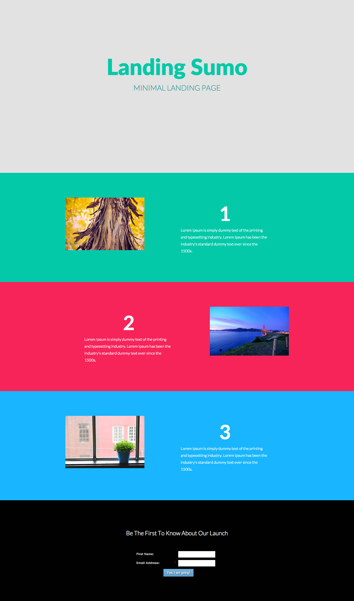

# Plantilla 10A {#template-10a}

Haga clic con el botón derecho en [descargar plantilla 10A](https://51837-micrositemarketo.adobeio-static.net/lp-templates/template-10a.html) y seleccione **Guardar vínculo como...**

>[!NOTE]
>
>Puede encontrar los pasos completos para descargar e importar una plantilla [aquí](/help/marketo/product-docs/demand-generation/landing-pages/landing-page-templates/guided-landing-page-template-list.md#how-to-import){target="_blank"}.

Esta plantilla incluye el siguiente contenido:

* Una sección principal (opcional)

  * Incluye título y texto para héroes

* Tres secciones del cuerpo (opcional)
* Un pie de página (opcional)

**Haga clic con el botón derecho a continuación (y seleccione _Guardar vínculo como..._) para descargar esta plantilla:**

[Plantilla 10A.html](https://51837-micrositemarketo.adobeio-static.net/lp-templates/template-10a.html)
