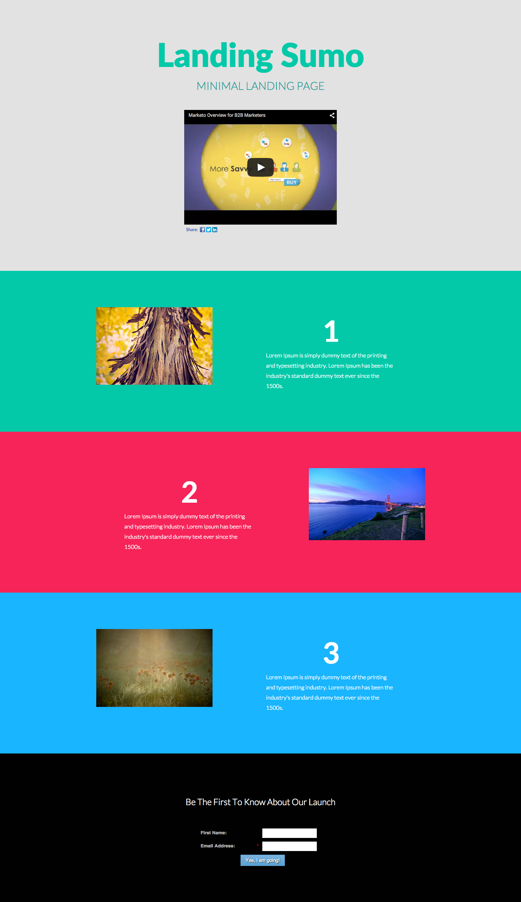

# Plantilla 10C {#template-10c}

Haga clic con el botón derecho para [descargar la plantilla 10C](https://experienceleague.adobe.com/landing/marketo/lp-templates/template-10c.html)

Esta plantilla incluye el siguiente contenido:

* Una sección principal

   * incluye un encabezado, texto y un vídeo de héroe

* Tres secciones del cuerpo (opcional)
* Un pie de página (opcional)

**Haga clic con el botón secundario para descargar esta plantilla:**

[Plantilla 10C.html](https://experienceleague.adobe.com/landing/marketo/lp-templates/template-10c.html)
