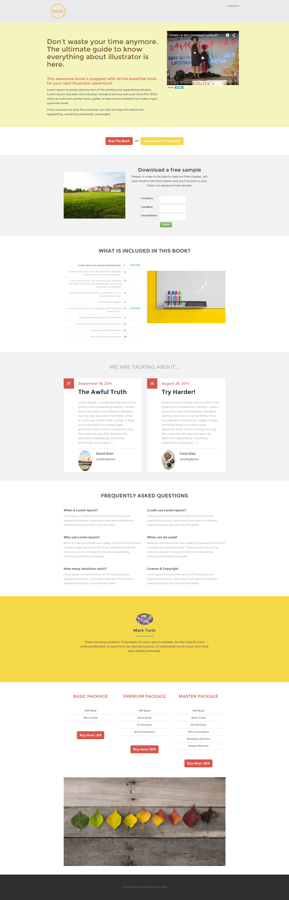

# Plantilla 12B {#template-12b}

Haga clic con el botón derecho para [descargar plantilla 12B](https://experienceleague.adobe.com/landing/marketo/lp-templates/template-12b.html)

Esta plantilla incluye el siguiente contenido:

* Un encabezado (opcional)
* Una sección principal

   * incluye título a pantalla completa, texto a pantalla completa e imagen a pantalla completa

* Seis secciones de cuerpo (opcional)
* Pie de página (opcional)

**Haga clic con el botón derecho para descargar esta plantilla:**

[Plantilla 12B.html](https://experienceleague.adobe.com/landing/marketo/lp-templates/template-12b.html)
