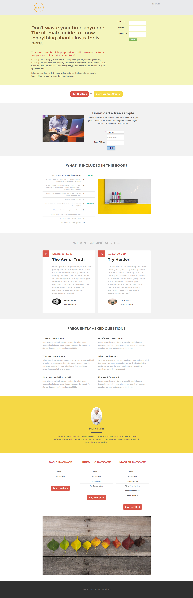

# Plantilla 12D {#template-12d}

Haga clic con el botón derecho para [descargar plantilla 12D](https://experienceleague.adobe.com/landing/marketo/lp-templates/template-12d.html)

Esta plantilla incluye el siguiente contenido:

* Un encabezado (opcional)
* Una sección principal

   * incluye título de héroe, texto de héroe y formulario

* Seis secciones del cuerpo (opcional)
* Pie de página (opcional)

**Haga clic con el botón secundario para descargar esta plantilla:**

[Plantilla 12D.html](https://experienceleague.adobe.com/landing/marketo/lp-templates/template-12d.html)
