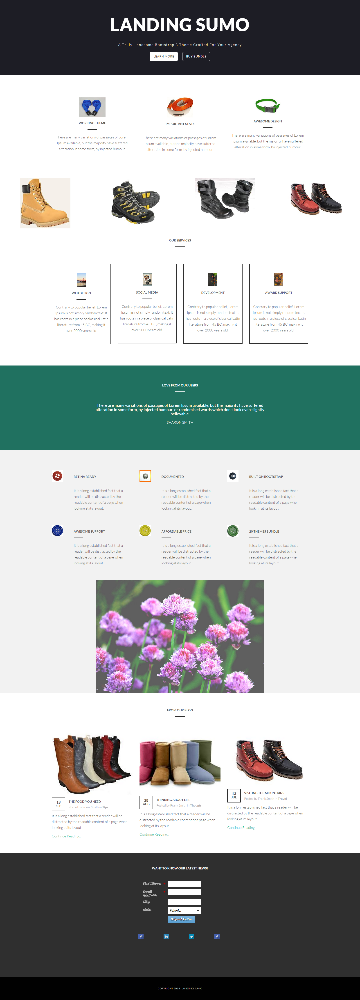

# Plantilla 17A {#template-17a}

Haga clic con el botón derecho para [descargar plantilla 17A](https://experienceleague.adobe.com/landing/marketo/lp-templates/template-17a.html)

Esta plantilla incluye el siguiente contenido:

* Una sección principal

   * incluye título a pantalla completa, texto a pantalla completa y dos botones

* Seis secciones de cuerpo (opcional)
* Pie de página (opcional)

**Haga clic con el botón derecho para descargar esta plantilla:**

[Plantilla 17A.html](https://experienceleague.adobe.com/landing/marketo/lp-templates/template-17a.html)
