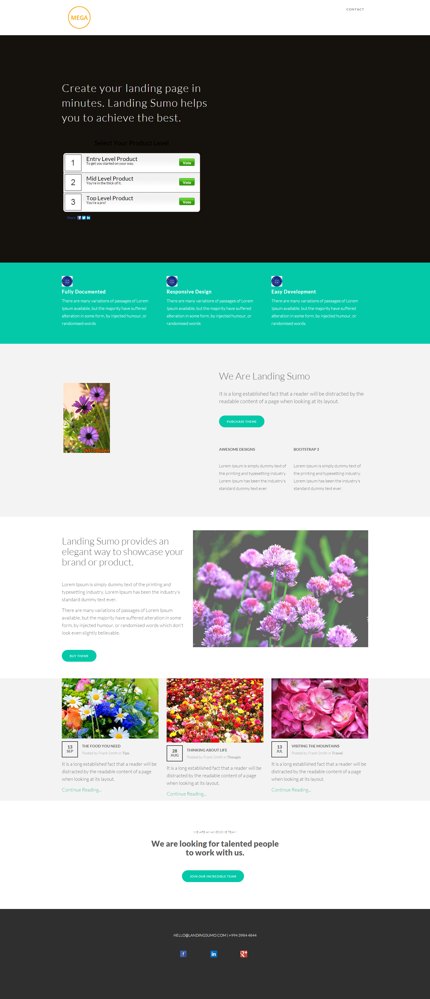

# Plantilla 18C {#template-18c}

Haga clic con el botón derecho en [descargar plantilla 18C](https://51837-micrositemarketo.adobeio-static.net/lp-templates/template-18c.html) y seleccione **Guardar vínculo como...**

>[!NOTE]
>
>Puede encontrar los pasos completos para descargar e importar una plantilla [aquí](/help/marketo/product-docs/demand-generation/landing-pages/landing-page-templates/guided-landing-page-template-list.md#how-to-import){target="_blank"}.

Esta plantilla incluye el siguiente contenido:

* Un encabezado (opcional)
* Una sección principal

  * incluye texto a pantalla completa y sondeo

* Cinco secciones del cuerpo (opcional)
* Pie de página (opcional)

**Haga clic con el botón derecho a continuación (y seleccione _Guardar vínculo como..._) para descargar esta plantilla:**

[Plantilla 18C.html](https://51837-micrositemarketo.adobeio-static.net/lp-templates/template-18c.html)
