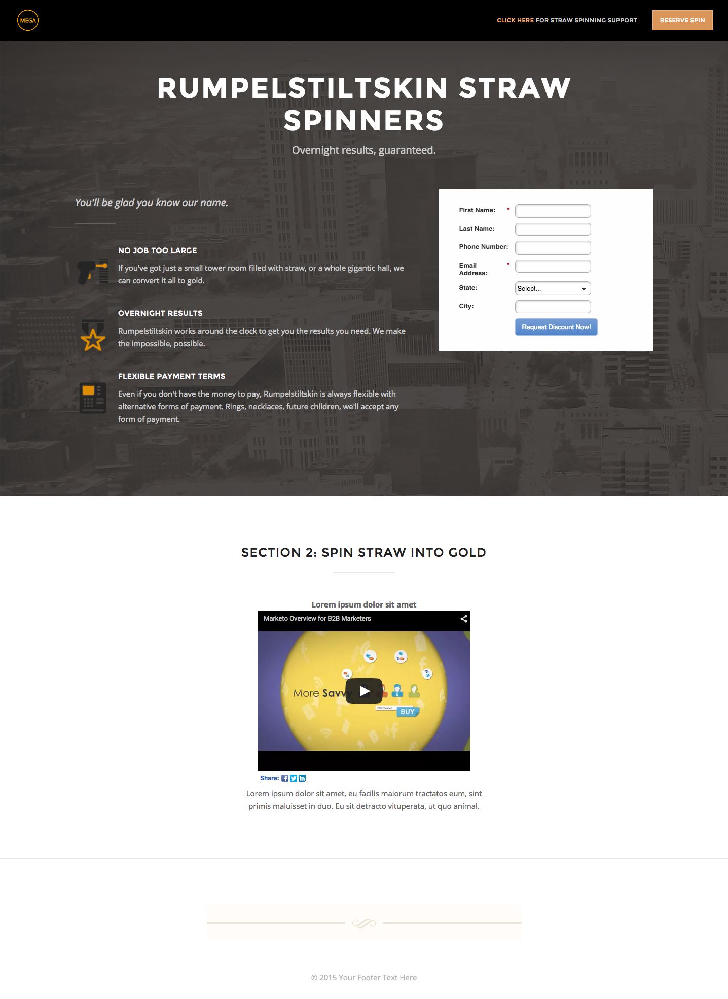

# Plantilla 2B {#template-2b}

Haga clic con el botón derecho para [descargar la plantilla 2B](https://experienceleague.adobe.com/landing/marketo/lp-templates/template-2b.html?lang=es)

Esta plantilla incluye el siguiente contenido:

* Un encabezado con logotipo y botón (opcional)
* Una sección principal

   * incluye una imagen de fondo a pantalla completa, encabezado, eslogan, lista con viñetas y formulario.

* Una sección del cuerpo con vídeo y texto (opcional)
* Pie de página (opcional)

**Haga clic con el botón secundario para descargar esta plantilla:**

[Plantilla 2B.html](https://experienceleague.adobe.com/landing/marketo/lp-templates/template-2b.html?lang=es)
