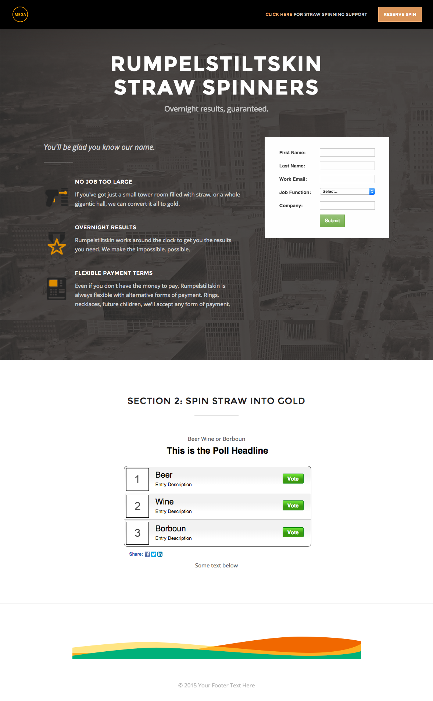

# Plantilla 2D {#template-2d}

Haga clic con el botón derecho para [descargar plantilla 2D](https://experienceleague.adobe.com/landing/marketo/lp-templates/template-2d.html)

Esta plantilla incluye el siguiente contenido:

* Un encabezado con logotipo y botón (opcional)
* Una sección principal

   * incluye imagen de fondo a pantalla completa, encabezado, etiqueta, lista con viñetas y formulario.

* Una sección del cuerpo con texto y sondeo (opcional)
* Pie de página (opcional)

**Haga clic con el botón derecho para descargar esta plantilla:**

[Plantilla 2D.html](https://experienceleague.adobe.com/landing/marketo/lp-templates/template-2d.html)
