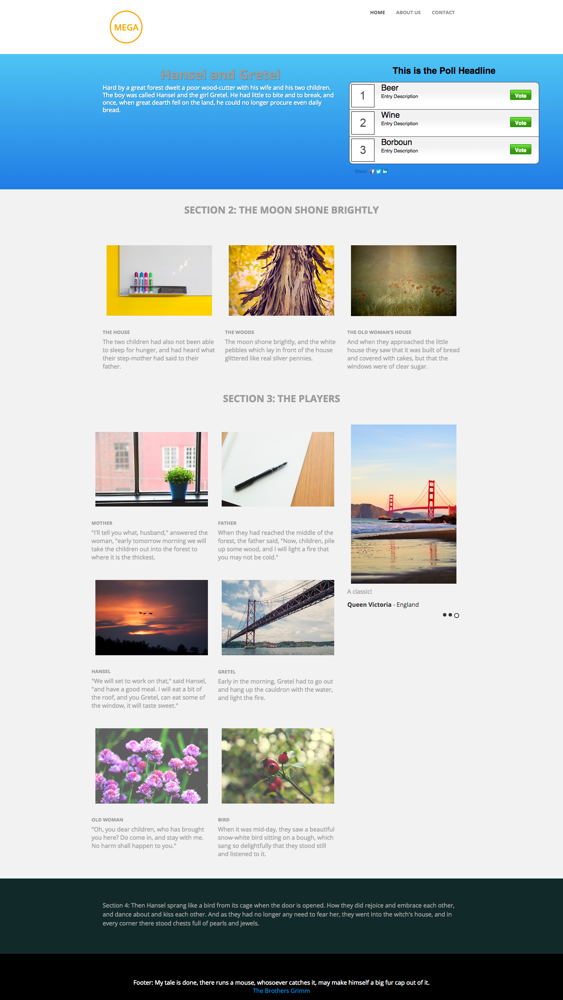

# Plantilla 3C {#template-3c}

Haga clic con el botón derecho para [descargar plantilla 3C](https://experienceleague.adobe.com/landing/marketo/lp-templates/template-3c.html)

Esta plantilla incluye el siguiente contenido:

* Un encabezado con logotipo y 3 botones (opcional)
* Una sección principal

   * incluye texto a pantalla completa y Encuesta.

* Tres secciones de cuerpo (opcional)
* Pie de página (opcional)

**Haga clic con el botón derecho para descargar esta plantilla:**

[Plantilla 3C.html](https://experienceleague.adobe.com/landing/marketo/lp-templates/template-3c.html)
