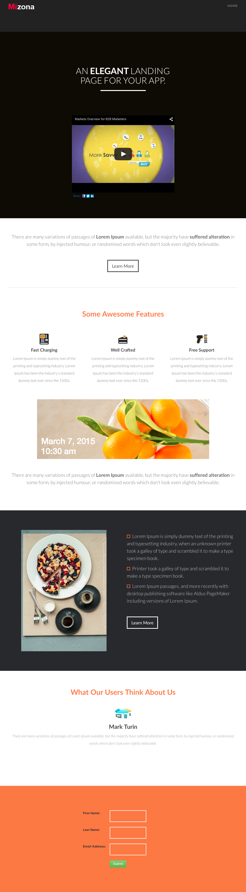

# Plantilla 7B {#template-7b}

Haga clic con el botón derecho para [descargar la plantilla 7B](https://experienceleague.adobe.com/landing/marketo/lp-templates/template-7b.html?lang=es)

Esta plantilla incluye el siguiente contenido:

* Un encabezado (opcional)
* Una sección principal

   * incluye un encabezado y un vídeo

* Cuatro secciones del cuerpo (opcional)
* Un pie de página (opcional)

**Haga clic con el botón secundario para descargar esta plantilla:**

[Plantilla 7B.html](https://experienceleague.adobe.com/landing/marketo/lp-templates/template-7b.html?lang=es)
