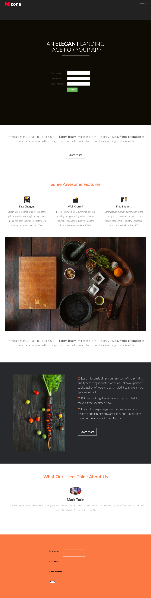

# Plantilla 7-D {#template-d}

[Descargar plantilla 7-D](https://docs.marketo.com/download/attachments/8783950/template-7d.html?version=1&amp;modificationdate=1437693396000&amp;api=v2)

Esta plantilla incluye el siguiente contenido:

* Un encabezado (opcional)
* Una sección principal

   * incluye un encabezado y un formulario

* Cuatro secciones de cuerpo (opcional)
* Un pie de página (opcional)

**Haga clic abajo para descargar esta plantilla:**

[Plantilla7-D.html](https://docs.marketo.com/download/attachments/8783950/template-7d.html?version=1&amp;modificationdate=1437693396000&amp;api=v2)
