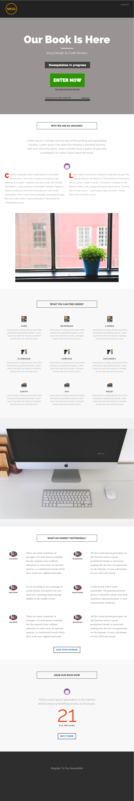

# Plantilla 8-F {#template-f}

[Descargar plantilla 8-F](https://docs.marketo.com/download/attachments/8783975/template-8f.html?version=1&amp;modificationdate=1482175174000&amp;api=v2)

Esta plantilla incluye el siguiente contenido:

* Un encabezado (opcional)
* Una sección principal

   * incluye un encabezado a pantalla completa, texto a pantalla completa y un comodín

* Cinco secciones de cuerpo (opcional)
* Un pie de página (opcional)

**Haga clic abajo para descargar esta plantilla:**

[Plantilla8-F.html](https://docs.marketo.com/download/attachments/8783975/template-8f.html?version=1&amp;modificationdate=1482175174000&amp;api=v2)
