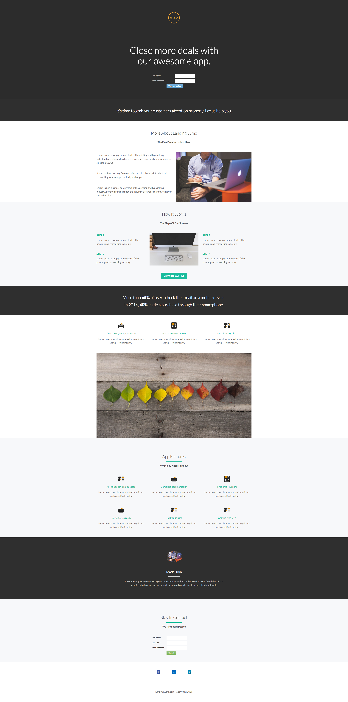

# Plantilla 9-A {#template-a}

[Descargar plantilla 9-A](https://docs.marketo.com/download/attachments/8783981/template-9a.html?version=2&amp;modificationdate=1438210648000&amp;api=v2)

Esta plantilla incluye el siguiente contenido:

* Una sección principal

   * incluye una imagen de logotipo a pantalla completa, un encabezado a pantalla completa y un formulario

* Ocho secciones de cuerpo (opcional)
* Un pie de página (opcional)

**Haga clic abajo para descargar esta plantilla:**

[Plantilla9-A.html](https://docs.marketo.com/download/attachments/8783981/template-9a.html?version=2&amp;modificationdate=1438210648000&amp;api=v2)
