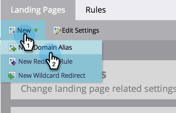
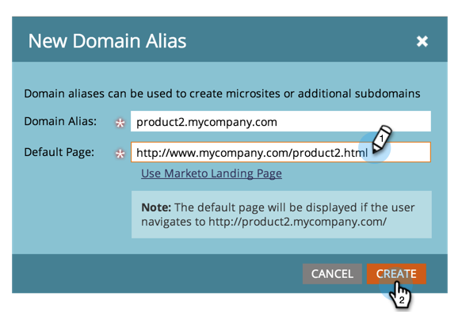

# Añadir CNAME de página de destino adicional {#add-additional-landing-page-cnames}

Es posible que desee añadir CNAME de página de aterrizaje para permitir que distintas URL apunten a sus páginas de aterrizaje de Marketo. Seguir los pasos a continuación le ayudará a administrar varios dominios.

>[!CAUTION]
>
>Las cookies no se pueden compartir entre dominios.

>[!TIP]
>
>**Mismo dominio de nivel superior - ¡Bien! Se comparten las cookies**.  **ir**.mycompany.com > **información**.mycompany.com
>
>**Diferentes dominios de nivel superior - ¡Malo! Las cookies _no_ se han compartido**.  ir.**mycompany**.com > ir.**mynewcompany**.com

>[!NOTE]
>
>**Se requieren permisos de administrador**

1. Vaya al área de **Admin**.

   

1. Haga clic en **Mi cuenta**.

   

1. Desplácese hacia abajo hasta &quot;Información de asistencia&quot; y copie su Munchkin ID.

   

## Enviar solicitud a TI {#send-request-to-it}

1. Pida al departamento de TI que configure el siguiente CNAME: (Reemplace la palabra [CNAME] por el CNAME de su elección y [Munchkin ID] por el texto del paso anterior).

   [CNAME].YourCompany.com > [Munchkin ID].mktoweb.com

## Añadir un nuevo CNAME {#add-a-new-cname}

1. Una vez que el departamento de TI haya creado el CNAME, vaya al área de **Admin**.

   

1. Haga clic en **Páginas de aterrizaje**.

   

1. Haga clic en **[!UICONTROL Nuevo]** y, a continuación, seleccione **[!UICONTROL Nuevo alias de dominio]**.

   

1. Escriba su **[!UICONTROL alias de dominio].** **[!UICONTROL Página predeterminada]** se muestra si el visitante no escribe una dirección URL. Introduzca a dónde deben ir en ese caso.

   >[!NOTE]
   >
   >Para la [!UICONTROL página predeterminada], puede seleccionar una página de aterrizaje o una dirección URL externa, como un sitio web público.

   

1. Escriba su **[!UICONTROL página predeterminada]** y haga clic en **[!UICONTROL Crear]**.

   

¡Bonito! Ahora sabe qué hacer si alguna vez desea agregar un CNAME.
