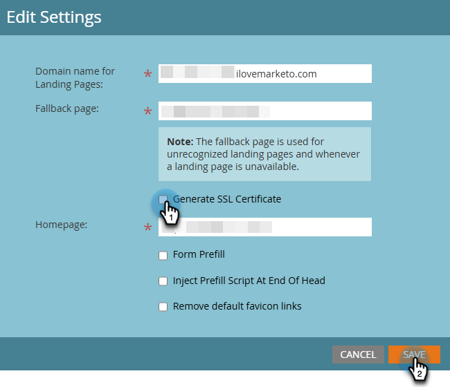

# Añadir SSL a las páginas de aterrizaje {#add-ssl-to-your-landing-pages}

El cifrado SSL (Secure Socket Layer) permite que todas las páginas de destino de una instancia de Marketo Engage sean seguras.

Al rellenar un formulario web o visitar una página de aterrizaje alojada en Marketo Engage, la información se envía de forma predeterminada a través de un protocolo no seguro (HTTP). Según la política de su empresa, es posible que desee proteger la información enviada a Marketo a través de (HTTPS). Por ejemplo, cuando visite `http://info.mydomain.com/`, ahora será `https://info.mydomain.com/`.

Marketo Engage realiza un seguimiento predeterminado de &quot;Página web visitada&quot; y &quot;Haga clic en el vínculo de la página web&quot; a través del protocolo HTTP no seguro. Si desea que los vínculos de seguimiento estén protegidos con su propio certificado, debe hacer que Marketo cree un servidor no compartido independiente para habilitarlo. Proteger todos los aspectos de la interacción de un contacto con usted suele significar proteger tanto las páginas de aterrizaje como los vínculos de seguimiento.

## Habilitar la certificación SSL {#enable-ssl-certification}

Agregue automáticamente SSL para todos los alias de dominio que cree como parte de las reglas de la página de aterrizaje.

1. Vaya al área de **Admin**.

   

1. Seleccione **Páginas de aterrizaje** del árbol. En la ficha **Reglas**, haga clic en la lista desplegable **Nuevo** y seleccione **Nuevo alias de dominio**.

   

1. Escriba su _alias de dominio_ y _página predeterminada_. Seleccione la casilla de verificación **Generar certificado SSL**. Haga clic en **Crear** cuando haya terminado.

   

Esto agrega automáticamente un certificado SSL para este dominio.

## Habilite SSL para su dominio predeterminado {#enable-ssl-default-domain}

Siga los pasos a continuación para habilitar SSL para su dominio predeterminado.

1. En la sección **Admin**, seleccione **Páginas de aterrizaje**. Haga clic en el botón **Editar** naranja que está junto a _Configuración_.

   {width="800" zoomable="yes"}

   >[!NOTE]
   >
   >Si lo desea, también puede modificar el nombre de dominio aquí (se requiere un dominio válido).

1. Seleccione la casilla de verificación &quot;Generar certificado SSL&quot; y haga clic en Guardar.

   

>[!NOTE]
>
>* La columna Certificado SSL de la lista muestra el estado del certificado para todos los alias de dominio creados después de que se lanzara esta función (25 de abril de 2025). Si ha habilitado SSL para un dominio mediante el Soporte técnico de Marketo, el certificado seguirá existiendo, pero no se mostrará en la tabla. Esta tabla solo refleja los certificados SSL para los dominios agregados mediante los pasos de este artículo.
>
>* SSL puede tardar hasta tres minutos en estar en estado READY. Debe actualizar la página para que aparezcan los cambios.

## Mensajes de error {#error-messages}

A continuación, encontrará mensajes de error que puede recibir junto con sus definiciones.

<table><thead>
  <tr>
    <th>Error</th>
    <th>Detalles</th>
  </tr></thead>
<tbody>
  <tr>
    <td><i>Error inesperado al crear un dominio. Póngase en contacto con Soporte para obtener ayuda.</i></td>
    <td>Se ha producido un error inesperado. Recopile registros y detalles del error y remita el problema al equipo de asistencia.</td>
  </tr>
  <tr>
    <td><i>No se ha encontrado el dominio predeterminado. Póngase en contacto con Soporte para obtener ayuda.</i></td>
    <td>Se ha producido un problema al intentar localizar el dominio predeterminado. Póngase en contacto con Asistencia para que puedan investigar.</td>
  </tr>
  <tr>
    <td><i>Ya se ha emitido el certificado SSL.</i></td>
    <td>Ya existe un certificado SSL para este dominio personalizado. No es necesario realizar ninguna otra acción a menos que el certificado haya caducado o sea necesario volver a emitirlo.</td>
  </tr>
  <tr>
    <td><i>El dominio no está asignado al dominio predeterminado.</i></td>
    <td>El dominio personalizado no está asignado correctamente al dominio predeterminado. Compruebe la configuración de asignación de dominios y asegúrese de que la configuración de DNS apunta al dominio predeterminado correcto.</td>
  </tr>
  <tr>
    <td><i>El dominio ya existe.</i></td>
    <td>Ya existe un dominio con el mismo nombre.</td>
  </tr>
  <tr>
    <td><i>Se requiere una configuración IP única antes de agregar más dominios. Póngase en contacto con el soporte técnico para completar la configuración y vuelva a intentar agregar otro dominio.</i></td>
    <td>El primer dominio personalizado después del dominio predeterminado necesita que inicie una configuración única. Cree un ticket de asistencia para completar la configuración y añada el dominio una vez finalizado.</td>
  </tr>
</tbody></table>

## Cosas que hay que tener en cuenta {#things-to-note}

* **Asignación de DNS para el dominio en Marketo Engage**: antes de agregar dominios en la interfaz de usuario, debe [asignar CNAME a un dominio proporcionado por Marketo](https://experienceleague.adobe.com/es/docs/marketo/using/getting-started/initial-setup/setup-steps#customize-your-landing-page-urls-with-a-cname){target="_blank"}.

* **SSL personalizados**: Si necesita un SSL personalizado, envíe un [ticket de asistencia](https://nation.marketo.com/t5/support/ct-p/Support){target="_blank"}. No utilice la casilla de verificación de autoservicio para la creación SSL.

* **SSL preexistentes**: Al agregar un dominio, el sistema comprueba los SSL preexistentes, que pueden haberse creado manualmente anteriormente. Si encuentra esta validación, cree su dominio sin seleccionar la creación de SSL y los conectaremos por usted. [Póngase en contacto con el soporte técnico](https://nation.marketo.com/t5/support/ct-p/Support){target="_blank"} para obtener más detalles u opciones.

* **Dominio de seguimiento por primera vez**: La primera vez que se creen dominios de vínculo de seguimiento de correo electrónico necesitará la intervención manual del [Soporte técnico de Marketo](https://nation.marketo.com/t5/support/ct-p/Support){target="_blank"}. En la interfaz de usuario se permite la creación posterior de subdominios en el mismo dominio.

* **Agregar certificados a dominios existentes**: no se admite agregar certificados a dominios existentes en este momento. Para los dominios preexistentes o en los casos en los que no hayas marcado el cuadro de certificado SSL, debes ponerte en contacto con el [Soporte técnico de Marketo](https://nation.marketo.com/t5/support/ct-p/Support){target="_blank"} para que se agregue el certificado.

* **Eliminación de dominios**: al eliminar un dominio, no se elimina automáticamente el certificado SSL en este momento. Esto se solucionará en una versión futura.
