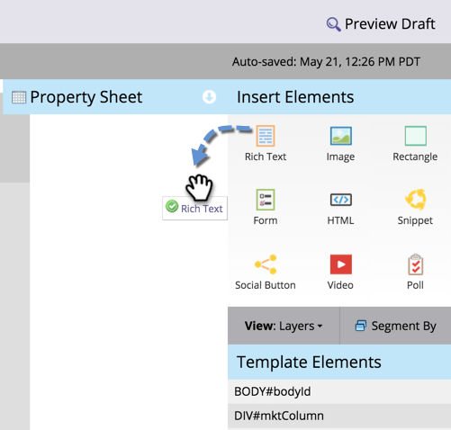
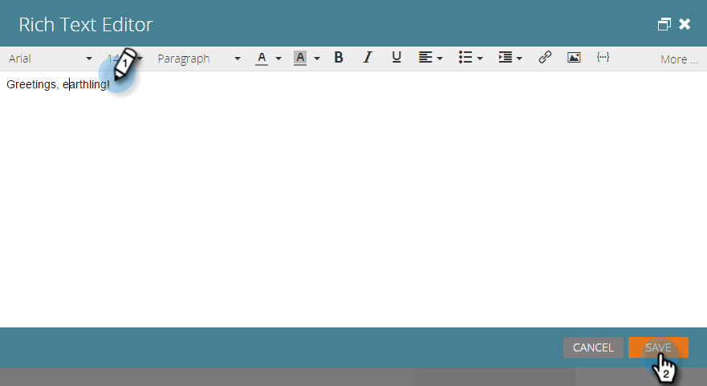
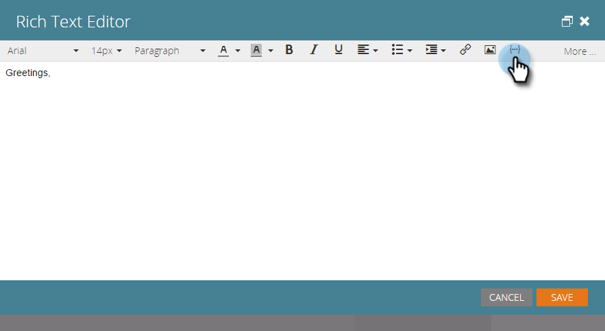
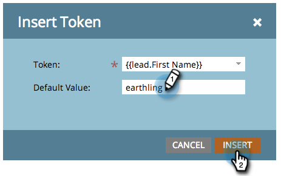
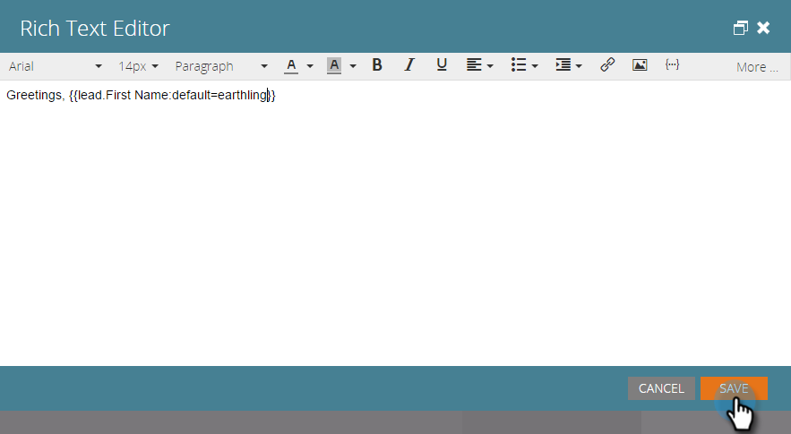

# Añadir texto y tókenes a una página de destino {#add-text-and-tokens-to-a-landing-page}

>[!NOTE]
>
>Los tokens solo se admiten en las páginas de aterrizaje de Marketo.

## Añadir texto enriquecido a la página de aterrizaje {#add-rich-text-to-your-landing-page}

1. Seleccione la página de aterrizaje y haga clic en **[!UICONTROL Editar borrador]**.

   

   >[!NOTE]
   >
   >El diseñador de la página de aterrizaje se abre en una nueva ventana.

1. Arrastre sobre el elemento **[!UICONTROL Texto enriquecido]**.

   

1. Escriba el texto que desee y haga clic en **[!UICONTROL Guardar]**.

   

Ahora que sabe cómo agregar texto a una página de aterrizaje, la siguiente sección trata sobre agregar un token.

## Añadir un token a la página de aterrizaje {#add-a-token-to-your-landing-page}

Los tokens son fragmentos de texto dinámicos que pueden personalizar la página de aterrizaje.

>[!TIP]
>
>Los valores como Nombre provienen del registro de persona. Otros tokens provienen de la pestaña Mis tokens del programa.

1. Seleccione la página de aterrizaje y haga clic en **[!UICONTROL Editar borrador]**.

   

   >[!NOTE]
   >
   >El diseñador de la página de aterrizaje se abre en una nueva ventana.

1. Haga doble clic en el cuadro de texto enriquecido al que desee agregar el token.

   

1. Haga clic en el icono Insertar token.

   

1. Busque y seleccione el token de su elección.

   

1. Escriba un **[!UICONTROL Valor predeterminado]** y haga clic en **[!UICONTROL Insertar]**.

   

1. Haga clic en **[!UICONTROL Guardar]**.

   

   Ahora tiene un token en la página de aterrizaje.
