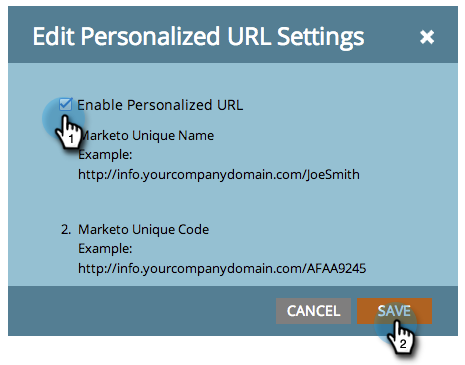

# Habilitar direcciones URL personalizadas para una página de destino {#enable-personalized-urls-for-a-landing-page}

Las direcciones URL personalizadas funcionan bien para las campañas de correo impreso.

>[!PREREQUISITES]
>
>[Habilitar direcciones URL personalizadas para su cuenta](/help/marketo/product-docs/demand-generation/landing-pages/personalizing-landing-pages/enable-personalized-urls-for-your-account.md)

1. Seleccione una página de aterrizaje y haga clic en la configuración de **[!UICONTROL URL personalizada]**.

   

1. Ahora puede marcar **[!UICONTROL Habilitar URL personalizada]** y hacer clic en **[!UICONTROL Guardar]**.

   

Ha habilitado direcciones URL personalizadas para la página de aterrizaje. Los visitantes que utilicen esa dirección URL se reconocerán y los tokens funcionarán correctamente.
