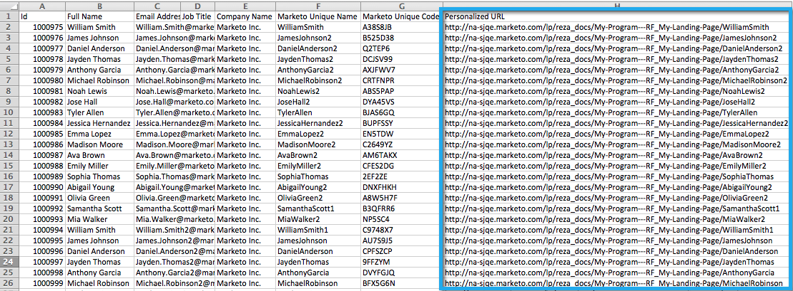

# Exportar una lista con direcciones URL personalizadas {#export-a-list-with-personalized-urls}

>[!PREREQUISITES]
>
>* [Habilitar direcciones URL personalizadas para su cuenta](/help/marketo/product-docs/demand-generation/landing-pages/personalizing-landing-pages/enable-personalized-urls-for-your-account.md)
>* [Habilitar direcciones URL personalizadas para una página de aterrizaje](/help/marketo/product-docs/demand-generation/landing-pages/personalizing-landing-pages/enable-personalized-urls-for-a-landing-page.md)

1. Seleccione la lista o lista inteligente, haga clic en el botón **Posibles clientes** para obtener los resultados y, a continuación, haga clic en el icono excel . INLINE Asegúrese de que tiene **Código único de Marketo** y **Nombre único de Marketo** [columnas visibles](/help/marketo/product-docs/core-marketo-concepts/smart-lists-and-static-lists/using-smart-lists/create-and-change-views-for-lists-and-smart-list.md).

   

1. Marque **Incluir URL personalizada**, busque y seleccione la página de aterrizaje para la que desee generar direcciones URL.

   

1. Seleccione el **URL**.

   

   >[!TIP]
   >
   >Si ve varias direcciones URL para la misma página de aterrizaje, es probable que se deba a que cambió la dirección URL de las páginas en algún momento del pasado y creó una redirección.

1. Elija un **Estilo** y haga clic en **Exportar**.

   

1. Cuando finalice la exportación, haga clic en el **Descargar ahora** para guardar el archivo.

   

   ¡Y ya terminaste! Ahora tiene una lista de posibles clientes y direcciones URL personalizadas.

   

   >[!NOTE]
   >
   >Si hay posibles clientes con el mismo nombre y apellido, los números se añaden automáticamente para garantizar que las direcciones URL sigan siendo únicas.
