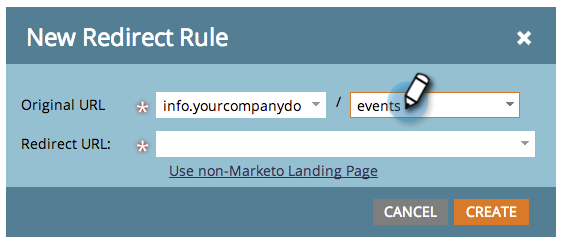

# Redireccionar una ruta de URL {#redirect-a-url-path}

Marketo facilita la redirección de una ruta de URL a cualquier página que elija. Así es como.

>[!NOTE]
>
>**Se requieren permisos de administrador**

1. En **Administrador**, haga clic en **Páginas de aterrizaje**.

   

1. Haga clic en el **Reglas** a continuación, haga clic en **Nuevo** y **Nueva regla de redirección**.

   

1. Haga clic en la primera **URL original** y seleccione su CNAME de Marketo.

   

   >[!NOTE]
   >
   >Recuerde, solo puede redirigir las direcciones URL que empiecen por Marketo [CNAME](/help/marketo/product-docs/demand-generation/landing-pages/landing-page-actions/customize-your-landing-page-urls-with-a-cname.md).

1. Escriba la ruta de URL (o página específica) que desee redirigir en el segundo **URL original** a la derecha.

   

1. Haga clic en **Usar página de aterrizaje que no sea de Marketo**, escriba la página a la que desee redirigir a los visitantes en la **Dirección URL de redireccionamiento** y haga clic en **Crear**.

   

   Puede [usar páginas de aterrizaje de Marketo](/help/marketo/product-docs/demand-generation/landing-pages/landing-page-actions/redirect-a-marketo-landing-page-to-another-page.md) como destino.

¡Felicidades! Ha redirigido correctamente la ruta URL.

>[!MORELIKETHIS]
>
>[Redireccionar una página de aterrizaje de Marketo a otra página](/help/marketo/product-docs/demand-generation/landing-pages/landing-page-actions/redirect-a-marketo-landing-page-to-another-page.md)
