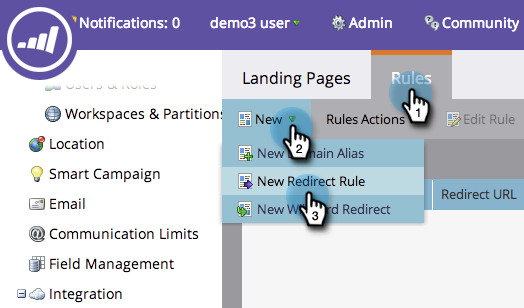

# Redireccionar una ruta de URL {#redirect-a-url-path}

Marketo facilita el redireccionamiento de una ruta de URL a cualquier página que elija.

>[!NOTE]
>
>**Se requieren permisos de administrador**

1. En **[!UICONTROL Administrador]**, haga clic en **[!UICONTROL Páginas de aterrizaje]**.

   

1. Haga clic en la ficha **[!UICONTROL Reglas]**, luego haga clic en **[!UICONTROL Nueva]** y **[!UICONTROL Nueva regla de redireccionamiento]**.

   

1. Haga clic en la primera lista desplegable **[!UICONTROL URL original]** y seleccione su CNAME de Marketo.

   

   >[!NOTE]
   >
   >Recuerde, solo puede redirigir direcciones URL que comiencen con su Marketo [CNAME](/help/marketo/product-docs/demand-generation/landing-pages/landing-page-actions/customize-your-landing-page-urls-with-a-cname.md).

1. Escriba la ruta URL (o página específica) que quiera redirigir en el segundo campo **[!UICONTROL URL original]** de la derecha.

   

1. Haga clic en **[!UICONTROL Usar página de aterrizaje que no sea de Marketo]**, escriba la página a la que desea redirigir a los visitantes en el campo **[!UICONTROL Redirigir URL]** y haga clic en **[!UICONTROL Crear]**.

   

   Puede [usar páginas de aterrizaje de Marketo](/help/marketo/product-docs/demand-generation/landing-pages/landing-page-actions/redirect-a-marketo-landing-page-to-another-page.md) como destino también.

Su ruta URL se ha redirigido correctamente.

>[!MORELIKETHIS]
>
>[Redirigir una página de aterrizaje de Marketo a otra página](/help/marketo/product-docs/demand-generation/landing-pages/landing-page-actions/redirect-a-marketo-landing-page-to-another-page.md)
