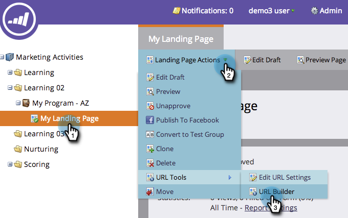

# Uso del Generador de direcciones URL {#using-the-url-builder}

El Generador de direcciones URL ayuda a construir direcciones URL que pueden rellenar campos de formulario ocultos de Marketo.

>[!PREREQUISITES]
>
>Obtenga información sobre cómo crear campos ocultos en formularios y editar su configuración en [Definir un campo de formulario como oculto](/help/marketo/product-docs/demand-generation/forms/form-fields/set-a-form-field-as-hidden.md).

1. Seleccione una página de aterrizaje, haga clic en **Acciones de página de aterrizaje**, pase el ratón sobre **Herramientas URL** y haga clic en **Generador de URL**.

   

1. Seleccione los campos que desee utilizar, introduzca el valor y haga clic en **Actualizar URL**.

   

   >[!NOTE]
   >
   >Si no ve ningún campo disponible en el generador, asegúrese de que el formulario tenga campos ocultos y de que [configurado para aceptar parámetros de URL](/help/marketo/product-docs/demand-generation/forms/form-fields/set-a-hidden-form-field-value.md#url-parameter).

¡bueno trabajo! Ahora puede copiar y pegar la dirección URL y utilizarla en la web.
