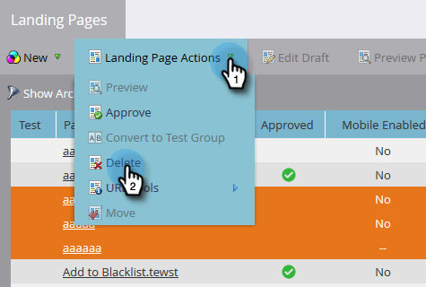

# Aprobar, desaprobar o eliminar una página de aterrizaje {#approve-unapprove-or-delete-a-landing-page}

Las páginas de aterrizaje están en modo de borrador hasta que las apruebe. La aprobación hace que las páginas estén disponibles en el resto del sistema. Cuando edita una página de aterrizaje aprobada, Marketo guarda el borrador, pero continúa utilizando la versión aprobada hasta que apruebe el borrador.

## Aprobar una página de aterrizaje {#approve-a-landing-page}

1. Seleccione una página de aterrizaje, vaya a **Acciones de página de aterrizaje** y haga clic en **Aprobar**.

   >[!TIP]
   >
   >Puedes [aprobar varias páginas a la vez](/help/marketo/product-docs/demand-generation/landing-pages/landing-page-actions/approve-multiple-landing-pages-at-once.md) para facilitar tu vida.

   

1. También puedes hacer clic con el botón derecho en tu página de aterrizaje y hacer clic en **Aprobar**.

   

   >[!NOTE]
   >
   >Una vez aprobado, el icono de la página de aterrizaje tendrá una marca de verificación verde.

## Desaprobar una página de aterrizaje {#unapprove-a-landing-page}

1. Seleccione una página de aterrizaje, vaya a **Acciones de página de aterrizaje** y haga clic en **Desaprobar**.

   

1. También puedes hacer clic con el botón derecho en tu página de aterrizaje y hacer clic en **Desaprobar**.

   

>[!NOTE]
>
>La página de aterrizaje no aprobada ya no se publica en la web y no genera actividad adicional. Los visitantes de páginas de aterrizaje no aprobadas y sus fichas de Facebook verán la [Página de reserva](/help/marketo/product-docs/administration/settings/set-a-fallback-page.md).

## Eliminar una página de aterrizaje {#delete-a-landing-page}

1. Seleccione una página de aterrizaje, vaya a **Acciones de página de aterrizaje** y haga clic en **Eliminar**.

   

   >[!NOTE]
   >
   >No puede eliminar una página de aterrizaje aprobada. Desapruébelo primero.

1. También puedes hacer clic con el botón derecho en tu página de aterrizaje y hacer clic en **Eliminar**.

   

## Eliminar varias páginas de aterrizaje {#delete-multiple-landing-pages}

¿Quiere eliminar más de una página de aterrizaje a la vez? Así es como.

1. En Design Studio, haga clic en **Páginas de destino**.

   

1. Haga clic en la primera página de aterrizaje que desee eliminar y, a continuación, Mayús + clic en la última.

   

   >[!TIP]
   >
   >También puede utilizar Ctrl+clic para eliminar varias páginas de aterrizaje que no sean secuenciales.

1. Haga clic en el menú desplegable **Acciones de página de aterrizaje** y seleccione **Eliminar**.

   

1. Haga clic en **Eliminar**.

   

¡Fantástico! Ahora sabe cómo aprobar, desaprobar y eliminar páginas de aterrizaje.
