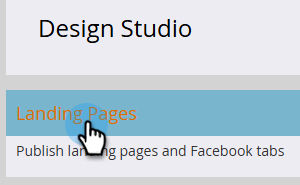
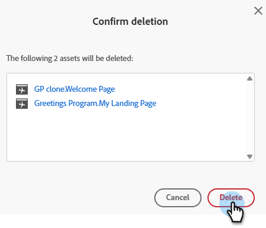

# Aprobar, desaprobar o eliminar una página de aterrizaje {#approve-unapprove-or-delete-a-landing-page}

Las páginas de aterrizaje están en modo de borrador hasta que las apruebe. La aprobación hace que las páginas estén disponibles en el resto del sistema. Cuando edita una página de aterrizaje aprobada, Marketo Engage guarda el borrador, pero continúa utilizando la versión aprobada hasta que apruebe el borrador.

## Aprobar una página de aterrizaje {#approve-a-landing-page}

1. Seleccione la página de aterrizaje deseada, haga clic y luego haga clic en **[!UICONTROL Aprobar borrador]**.

   

   >[!TIP]
   >
   >Si lo desea, puede [aprobar varias páginas a la vez](/help/marketo/product-docs/demand-generation/landing-pages/landing-page-actions/approve-multiple-landing-pages-at-once.md).

También puedes hacer clic con el botón derecho en tu página de aterrizaje en la barra de navegación izquierda y seleccionar **[!UICONTROL Aprobar]**.

>[!NOTE]
>
>Una página de aterrizaje aprobada tiene una marca de verificación verde añadida.

## Desaprobar una página de aterrizaje {#unapprove-a-landing-page}

1. Seleccione la página de aterrizaje deseada y haga clic en **[!UICONTROL Desaprobar]**.

   

También puede hacer clic con el botón derecho en la página de aterrizaje en la barra de navegación izquierda y seleccionar **[!UICONTROL Desaprobar]**.

>[!NOTE]
>
>Su página de aterrizaje no aprobada ya no se publica en la web y no generará ninguna actividad adicional. Los visitantes de páginas de aterrizaje no aprobadas y sus fichas de Facebook verán la [Página de reserva](/help/marketo/product-docs/administration/settings/set-a-fallback-page.md).

## Eliminar una página de aterrizaje {#delete-a-landing-page}

1. Seleccione la página de aterrizaje que desee. Haga clic en el menú desplegable **[!UICONTROL Acciones de página de aterrizaje]** y seleccione **[!UICONTROL Eliminar]**.

   

   >[!IMPORTANT]
   >
   >No puede eliminar una página de aterrizaje aprobada. Primero debe desaprobarla.

También puede hacer clic con el botón derecho en la página de aterrizaje en la barra de navegación izquierda y seleccionar **[!UICONTROL Eliminar]**.

## Eliminar varias páginas de aterrizaje {#delete-multiple-landing-pages}

1. En la pantalla principal de [!UICONTROL Design Studio], haga clic en **[!UICONTROL Páginas de aterrizaje]**.

   

1. Seleccione las páginas de aterrizaje que desee. Haga clic en el menú desplegable **[!UICONTROL Acciones de página de aterrizaje]** y seleccione **[!UICONTROL Eliminar]**.

   

1. Haga clic en **[!UICONTROL Eliminar]** para confirmar.

   
