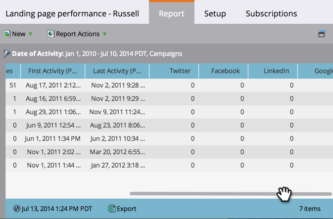

# Informe de rendimiento de la página de destino {#landing-page-performance-report}

Vea cuántas personas rellenaron los formularios en sus páginas de aterrizaje y cuántas de ellas fueron nuevas.

>[!NOTE]
>
>Si ve una discrepancia en las cifras entre su lista inteligente y el informe de rendimiento de la página de aterrizaje, es probable que las listas inteligentes solo filtren datos en Personas, mientras que los informes de rendimiento de la página de aterrizaje incluyen medios sociales (Facebook, Google Ads, etc.) y actividades anónimas, además de los datos de Personas.

1. [Cree un informe](/help/marketo/product-docs/reporting/basic-reporting/creating-reports/create-a-report-in-a-program.md) y seleccione el [!UICONTROL Rendimiento de la página de aterrizaje] [tipo de informe](/help/marketo/product-docs/reporting/basic-reporting/report-types/report-type-overview.md).
1. [Establezca el lapso de tiempo de su informe](/help/marketo/product-docs/reporting/basic-reporting/editing-reports/change-a-report-time-frame.md) y haga clic en la ficha [!UICONTROL Informe].
1. Explore el informe para evaluar el rendimiento de las páginas de aterrizaje.

   

   Entre las columnas del informe de rendimiento de la página de aterrizaje, Conversiones y % de conversión reflejan el número de veces que alguien ha rellenado un formulario.

   >[!TIP]
   >
   >Busque las páginas con el porcentaje de conversión más alto. [Ordene el informe](/help/marketo/product-docs/reporting/basic-reporting/editing-reports/sort-report-on-columns.md) en esa columna y elija Orden descendente.

   El icono AB del informe indica que las estadísticas son el total de todas las páginas de ese [grupo de prueba de página de aterrizaje](/help/marketo/product-docs/demand-generation/landing-pages/understanding-landing-pages/landing-page-test-groups.md).

1. Desplácese hacia la derecha para ver el número de visitas que se originaron en varias plataformas de medios sociales.

   

>[!MORELIKETHIS]
>
>[Filtre el informe de rendimiento de la página de aterrizaje](/help/marketo/product-docs/demand-generation/landing-pages/landing-page-actions/filter-a-landing-page-performance-report.md) por recursos locales o globales.
