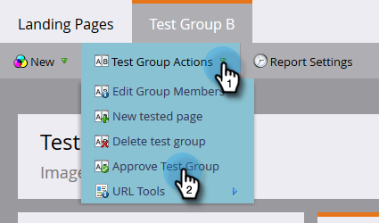

# Grupos de prueba de página de destino {#landing-page-test-groups}

Marketo realiza el seguimiento del número de vistas de página y de finalizaciones de formulario de cada página probada dentro de un grupo de prueba. Puede utilizar los resultados del grupo de prueba para decidir qué página de aterrizaje es la más convincente. Así es como se crea un grupo de prueba.

>[!PREREQUISITES]
>
>[Generar dos o más páginas de aterrizaje](/help/marketo/getting-started/quick-wins/landing-page-with-a-form.md), preferiblemente con un formulario.

1. En Design Studio, haga clic en **Nuevo**. En la lista desplegable , seleccione **Nuevo grupo de prueba**.

   

   >[!NOTE]
   >
   >Las otras formas de crear un grupo de prueba son:
   >
   >* Haga clic con el botón derecho en una página de aterrizaje del árbol y seleccione **Convertir en grupo de prueba**
   >* Crear un grupo de prueba de página de aterrizaje en un programa seleccionando **Grupo de prueba AB** en el **Nuevo recurso local** menú

1. Introduzca un nombre y una descripción opcional. Seleccione las páginas de aterrizaje que desee probar y haga clic en **Crear**.

   

   >[!NOTE]
   >
   >Solo las páginas de aterrizaje sin aprobar estarán disponibles para elegir.

1. Haga clic con el botón derecho en cada página de aterrizaje y seleccione **Aprobar**.

   

1. Haga clic en el **Opciones del grupo de prueba** lista desplegable y seleccione **Aprobar grupo de prueba**.

   

   ¡Eso es todo! Ahora podrá comparar los estados de las páginas de aterrizaje seleccionadas.

   

   >[!TIP]
   >
   >Si alguna vez desea eliminar el grupo de prueba, simplemente haga clic en **Acciones de grupo de prueba** y seleccione **Eliminar grupo de prueba**.
