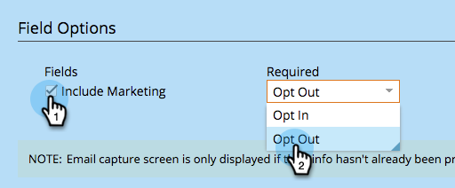

# Configurar las solicitudes después del uso compartido {#configure-after-share-prompts}

En las aplicaciones de botón social, uso compartido de vídeo y encuesta, puede elegir qué sucede después de que una persona comparta el contenido en su red social.

1. Vaya a **Actividades de marketing**.

   

1. Seleccione la aplicación y haga clic en **Editar borrador**.

   

1. En el editor de aplicaciones sociales, vaya a **Configuración de la aplicación** y luego **Opciones avanzadas**.

   

1. Para **Después de compartir**, seleccione el comportamiento que desee.

   

   * **Mensaje de confirmación:** Una vez que la persona haya compartido, muestre una confirmación.
   * **Captura de correo electrónico:** Una vez que la persona haya compartido, solicite su dirección de correo electrónico.

   >[!NOTE]
   >
   >Si elige **Captura de correo electrónico**, la solicitud solo se muestra si la persona no ha proporcionado ya su información.

1. Si elige **Mensaje de confirmación:** Vaya a **Flujo compartido** y luego **Mensaje de confirmación**.

   

1. Edite el mensaje de confirmación.

   

1. Si elige **Captura de correo electrónico** (en lugar de confirmación): Vaya a **Flujo compartido** y luego **Captura de correo electrónico**.

   

1. Elija si desea incluir una solicitud de marketing y si esa casilla de verificación está seleccionada de forma predeterminada (**Exclusión**) o no (**Opt-in**).

   

1. Edite la solicitud de dirección de correo electrónico y la solicitud de marketing (si la ha incluido).

   
