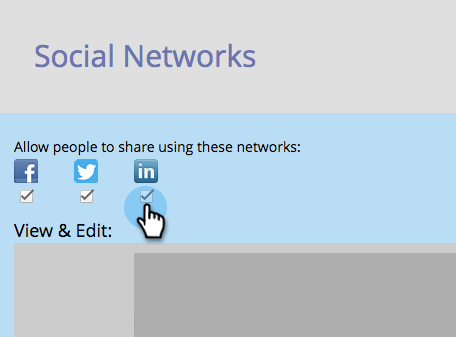
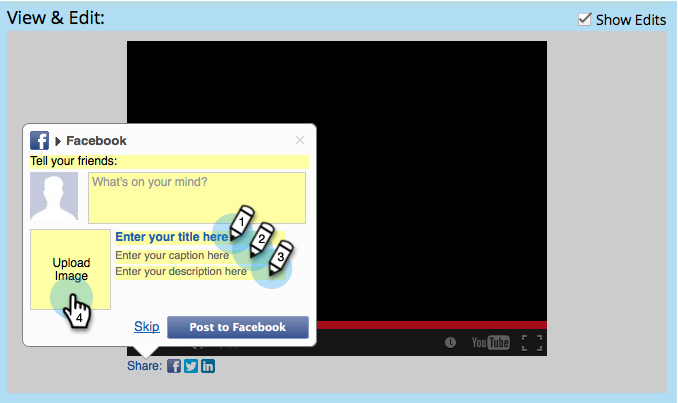

# Configurar el flujo recomendado por Social {#configure-social-recommend-flow}

Cuando crea una aplicación social, puede configurar las opciones de red social y las solicitudes que encuentra un usuario a medida que se registra.

## Seleccionar redes para uso compartido {#select-networks-for-sharing}

>[!NOTE]
>
>Esto es muy similar a [configuración del flujo de registro/uso compartido en redes sociales](/help/marketo/product-docs/demand-generation/social/configuring-social-actions/configure-social-sign-up-share-flow.md), pero esto es para los vínculos compartidos _under_ la aplicación social.

1. Vaya a **Actividades de marketing**.

   

1. Seleccione la aplicación y haga clic en **Editar borrador**.

   

1. En el editor de aplicaciones sociales, vaya a **Flujo recomendado** > **Redes sociales**.

   

1. Seleccione las redes a las que un usuario puede compartir.

   

## Configuración del mensaje de Facebook {#configure-the-facebook-message}

1. Configure el mensaje que aparecerá en las publicaciones de Facebook.

   

   >[!NOTE]
   >
   >En un recurso compartido de vídeo, la miniatura se genera automáticamente.

   Si elige **Añadir contenido dinámico**, los valores de las etiquetas OpenGraph de la página (og:title, og:caption y og:description) y la miniatura se añaden automáticamente a las publicaciones de Facebook. Consulte el paso siguiente.

   Si elige **Añadir contenido estático**, introduzca el título, el rótulo y la descripción, y cargue una imagen. Consulte los dos pasos siguientes.

1. En la ventana Ver y editar , haga clic en **Mostrar ediciones** para personalizar el mensaje y el mensaje compartidos que aparecerán en los anuncios de Facebook.

   >[!TIP]
   >
   >Para obtener más información, consulte [Editar la configuración de publicación enriquecida de Facebook](/help/marketo/product-docs/demand-generation/facebook/edit-facebook-rich-post-settings.md).

   

   >[!NOTE]
   >
   >La variable [compartir URL](/help/marketo/product-docs/demand-generation/social/social-functions/choose-the-share-url-for-a-social-app.md) se añade automáticamente a todos los mensajes compartidos.

1. Si elige **Añadir contenido estático** arriba, edite el título, el rótulo y la descripción, y cargue una imagen personalizada (desde sus imágenes y archivos de Marketo).

   

   Consulte [Agregar imágenes y archivos a Marketo](/help/marketo/product-docs/demand-generation/images-and-files/add-images-and-files-to-marketo.md).

   >[!NOTE]
   >
   >Si carga una imagen, no la verá aquí hasta que cierre y vuelva a abrir el editor de aplicaciones sociales.

1. Haga clic en **Siguiente**.

Si elige , los valores de las etiquetas OpenGraph de la página (og:title, og:caption y og:description) y la miniatura se añaden automáticamente a las publicaciones de Facebook. Consulte el paso siguiente.

## Configuración del mensaje de Twitter {#configure-the-twitter-message}

1. Haga clic en para editar el mensaje y el mensaje compartidos que aparecerán en los tweets de Twitter.

   

   >[!TIP]
   >
   >Use {html_title} en el texto del tweet para mostrar automáticamente el título de la página.

1. Haga clic en **Siguiente**.

## Configuración del mensaje de LinkedIn {#configure-the-linkedin-message}

1. Configure el mensaje que aparecerá en las publicaciones de LinkedIn.

   

   Si elige **Añadir dinámica** contenido, los valores de las etiquetas de páginas (título y descripción) y la miniatura se añaden automáticamente a las publicaciones de LinkedIn. Consulte el paso siguiente.

   Si elige **Agregar estático** contenido, introduzca el título, el rótulo y la descripción, y cargue una imagen. Consulte los dos pasos siguientes.

1. En el **Ver y editar** ventana, haga clic en **Mostrar ediciones** y edite el mensaje y el mensaje compartidos que aparecerán en las publicaciones de LinkedIn.

   

   >[!TIP]
   >
   >Use {html_title} en el texto del anuncio para mostrar automáticamente el título de la página.

1. Si elige **Agregar estático** contenido anterior, edite el título y la descripción y cargue una imagen personalizada (desde sus imágenes y archivos de Marketo).

   

   Consulte [Agregar imágenes y archivos a Marketo](/help/marketo/product-docs/demand-generation/images-and-files/add-images-and-files-to-marketo.md).

   >[!NOTE]
   >
   >Si carga una imagen, no la verá aquí hasta que cierre y vuelva a abrir el editor de aplicaciones sociales.

1. Haga clic en **Siguiente**.

## Configurar el mensaje de confirmación {#configure-the-confirmation-message}

1. Edite el texto de la confirmación del uso compartido.

   

1. Haga clic en **Finalizar** > **Aprobar** y **Cerrar**.

   

>[!MORELIKETHIS]
>
>El siguiente paso es [agregar el recurso compartido de vídeo](/help/marketo/product-docs/demand-generation/social/configuring-social-actions/customize-video-share-flow.md) o [encuesta](/help/marketo/product-docs/demand-generation/social/creating-a-poll/create-a-poll.md) a una página de aterrizaje, Facebook o su propio sitio web.
