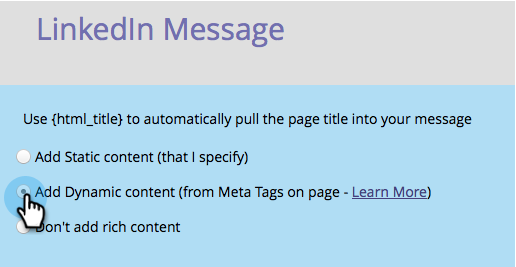

# Configurar flujo de registro social/uso compartido {#configure-social-sign-up-share-flow}

Al crear una aplicación social, puede configurar las opciones de redes sociales y las indicaciones que un usuario encuentra al registrarse.

## Seleccionar redes para compartir {#select-networks-for-sharing}

1. Vaya a **Actividades de marketing**.

   

1. Seleccione la aplicación y haga clic en **Editar borrador**.

   

1. En el editor de aplicaciones sociales, haga clic en **Flujo de registro** > **Redes sociales**.

   

1. Seleccione (o anule la selección) de las redes en las que una persona puede compartir.

   

## Configuración del mensaje de Facebook {#configure-the-facebook-message}

1. Vaya a **Flujo de registro** > **Compartir mensajes**.

   

1. Configure el mensaje que aparecerá en las publicaciones de Facebook.

   

   >[!NOTE]
   >
   >En un recurso compartido de vídeo, la miniatura se genera automáticamente.

   Si elige **Agregar contenido dinámico**, los valores de las etiquetas **OpenGraph** de la página (og:title, og:caption y og:description) y la miniatura se agregan automáticamente a las publicaciones de Facebook. Consulte el paso siguiente.

   Si elige **Agregar contenido estático**, escriba el título, el pie de ilustración, la descripción y cargue una imagen. Consulte los dos pasos siguientes.

1. En la ventana Ver y editar, haga clic en **Mostrar ediciones** y edite el mensaje y la solicitud para compartir que aparecerán en las publicaciones de Facebook.

   >[!TIP]
   >
   >Para obtener más información, consulte [Editar la configuración de publicaciones enriquecidas de Facebook](/help/marketo/product-docs/demand-generation/facebook/edit-facebook-rich-post-settings.md).

   

   >[!NOTE]
   >
   >[compartir URL](/help/marketo/product-docs/demand-generation/social/social-functions/choose-the-share-url-for-a-social-app.md) se agrega automáticamente a todos los mensajes compartidos.

1. Si eliges **Agregar contenido estático** más arriba, edita el título, el pie de ilustración y la descripción, y carga una imagen personalizada (de tus [**imágenes y archivos de Marketo**](/help/marketo/product-docs/demand-generation/images-and-files/add-images-and-files-to-marketo.md)).

   

   Ver [Agregar imágenes y archivos a Marketo](/help/marketo/product-docs/demand-generation/images-and-files/add-images-and-files-to-marketo.md).

   >[!NOTE]
   >
   >Si carga una imagen, no la verá aquí hasta que cierre y vuelva a abrir el editor de aplicaciones sociales.

1. Haga clic en **Siguiente**.

Si elige los valores de las etiquetas de la página (og:title, og:caption y og:description) y la miniatura se añade automáticamente a las publicaciones de Facebook. Consulte el paso siguiente.

## Configuración del mensaje de Twitter {#configure-the-twitter-message}

1. Edite la solicitud de uso compartido y el mensaje que aparecerán en los tweets de Twitter.

   

   >[!TIP]
   >
   >Use {html_title} en el texto del tweet para mostrar automáticamente el título de la página.

1. Haga clic en **Siguiente**.

## Configuración del mensaje de LinkedIn {#configure-the-linkedin-message}

1. Configure el mensaje que aparecerá en las publicaciones de LinkedIn.

   

   Si elige **Agregar contenido dinámico**, los valores de las etiquetas de páginas (título y descripción) y la miniatura se agregarán automáticamente a las publicaciones de LinkedIn. Consulte el paso siguiente.

   Si elige **Agregar contenido estático**, escriba el título, el pie de ilustración y la descripción, y cargue una imagen. Consulte los dos pasos siguientes.

1. En la ventana **Ver y editar**, haga clic en **Mostrar ediciones** y edite el mensaje y la solicitud para compartir que aparecerán en las publicaciones de LinkedIn.

   

   >[!TIP]
   >
   >Use {html_title} en el texto de la publicación para mostrar automáticamente el título de la página.

1. Si eliges **Agregar contenido estático** más arriba, edita el título y la descripción, y carga una imagen personalizada (de tus [**Imágenes y archivos de Marketo**](/help/marketo/product-docs/demand-generation/images-and-files/add-images-and-files-to-marketo.md)).

   

>[!NOTE]
>
>Si carga una imagen, no la verá aquí hasta que cierre y vuelva a abrir el editor de aplicaciones sociales.

>[!MORELIKETHIS]
>
>A continuación, puede hacer clic en **Finalizar** > **Aprobar y cerrar** y colocar la aplicación social en una página de aterrizaje. También puede configurar [captura de persona](/help/marketo/product-docs/demand-generation/social/configuring-social-actions/configure-person-capture-for-a-social-app.md) o el [mensaje para volver a compartir](/help/marketo/product-docs/demand-generation/social/configuring-social-actions/configure-re-share-email-and-prompt-for-a-social-app.md).
