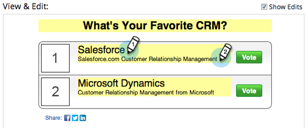

# Crear una encuesta {#create-a-poll}

Involucrar a la gente con una encuesta en la que puedan votar y compartir con sus amigos en las redes sociales. Puede agregarla a lugares como páginas de aterrizaje, sitios web y Facebook.

>[!AVAILABILITY]
>
>No todos los clientes han adquirido esta funcionalidad. Póngase en contacto con su representante de ventas para obtener más información.

>[!PREREQUISITES]
>
>Si desea utilizar imágenes en la encuesta, agréguelas a la biblioteca de imágenes y archivos de Marketo antes de comenzar. Agregue una imagen de 60 x 60 píxeles para cada entrada de encuesta. Consulte [Agregar imágenes y archivos a Marketo](/help/marketo/product-docs/demand-generation/images-and-files/add-images-and-files-to-marketo.md).

1. Dentro del programa, seleccione **Nuevo** > **Nuevo recurso local**.

   

1. En el **Galería de recursos locales**, haga clic en **Encuesta**.

   

1. Asigne un nombre a la encuesta.

   

   >[!TIP]
   >
   >Para ahorrar tiempo, puede usar la variable **Clonar desde** para copiar todos los ajustes de un recurso compartido de vídeo existente.

1. Envíe un titular a la encuesta (generalmente una pregunta corta).

   

1. Para cada entrada, edite el título y la descripción.

   

1. Para añadir una entrada, haga clic en el botón **+** y editar el título y la descripción.

   

1. Para cada entrada, puede agregar una imagen haciendo clic en la miniatura numerada.

   

1. Seleccione la imagen que necesita y haga clic en **Select**.

   

1. Cuando haya configurado la miniatura, el título y la descripción de todas las entradas, haga clic en **Finalizar**.

   

1. Haga clic en **Aprobar** y **Cierre.**

   

El editor de encuestas se abre en una nueva ventana. La configuración predeterminada es correcta, pero aún necesita añadir las entradas de encuesta. Le mostraremos cómo en los próximos pasos.

>[!TIP]
>
>Para cambiar cualquiera de los valores predeterminados en la encuesta, haga clic en **Atrás**. Para guardar el trabajo para más adelante sin aprobarlo, haga clic en **Cerrar**.

Si hay algún problema en la encuesta, se le pedirá que lo indique antes de aprobar la encuesta.

>[!IMPORTANT]
>
>Una encuesta ya no es editable después de que se haya enviado una votación.

>[!MORELIKETHIS]
>
>El siguiente paso es [publicar la encuesta](/help/marketo/product-docs/demand-generation/social/creating-a-poll/publish-a-poll.md), pero puede cambiar la configuración de la encuesta si es necesario. Comience por [personalización de la configuración de encuesta](/help/marketo/product-docs/demand-generation/social/creating-a-poll/customize-poll-settings.md).
