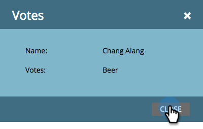

# Revisar los votos emitidos en la encuesta {#review-votes-cast-in-poll}

¿Quién votó por qué en tu encuesta? Vamos a averiguarlo.

>[!IMPORTANT]
>
>El 31 de julio de 2024, empezamos el proceso de dejar de utilizar esta función. Ya no se pueden crear nuevos recursos. Los recursos existentes seguirán funcionando hasta el 31 de enero de 2025. [Más información](https://nation.marketo.com/t5/employee-blogs/marketo-engage-social-features-deprecation/ba-p/351977){target="_blank"}

1. En **Actividades de marketing**, seleccione la encuesta y haga clic en la ficha **Participantes**.

   

1. Haga clic en el número de la columna **Votos**.

   

1. Se mostrará lo que votaron. Haga clic en **Cerrar**.

   

   >[!MORELIKETHIS]
   >
   >Obtenga más información acerca del alcance social y el impacto de sus aplicaciones en [Ver rendimiento social](/help/marketo/product-docs/demand-generation/social/social-functions/view-social-performance.md).
