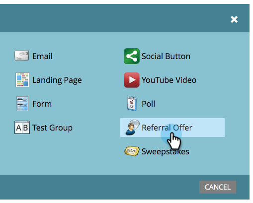

# Creación de una oferta de referencia {#create-a-referral-offer}

Las ofertas de reenvío ofrecen a las personas un incentivo para remitir a sus amigos. Cree objetivos y recompensas para los reenvíos correctos. Puede colocarlo en páginas de aterrizaje, en su sitio web e incluso en Facebook.

>[!AVAILABILITY]
>
>No todos los clientes han adquirido esta funcionalidad. Póngase en contacto con su representante de ventas para obtener más información.

1. Dentro del programa, seleccione **Nuevo** > **Nuevo recurso local**.

   

1. En el **Galería de recursos locales**, haga clic en **Oferta de referencia**.

   

1. Asigne un nombre a la oferta de referente.

   

   >[!TIP]
   >
   >Para ahorrar tiempo, puede usar la variable **Clonar desde** para copiar toda la configuración de una oferta de referente existente.

   El editor de ofertas de reenvío se abre en una nueva ventana. La configuración predeterminada es correcta, pero debe agregar un vínculo a las reglas (términos y condiciones) de la oferta. El vínculo aparecerá en la parte inferior de las pantallas de mensajes compartidos. Le mostraremos cómo en el próximo paso.

1. Haga clic en **Opciones avanzadas**.

   

1. Añada un vínculo a las reglas de la oferta. Introduzca la variable **URL**.

   

   >[!NOTE]
   >
   >En esta pantalla, también puede añadir un vínculo de política de privacidad. Consulte  [Agregar la política de privacidad a una aplicación social](/help/marketo/product-docs/demand-generation/social/social-functions/add-your-privacy-policy-to-a-social-app.md).

1. Haga clic en **Finalizar**.

   

1. Haga clic en **Aprobar y cerrar**.

   >[!TIP]
   >
   >Para cambiar cualquiera de los valores predeterminados de la oferta de referente, haga clic en **Atrás**. Para guardar el trabajo para más adelante sin aprobarlo, haga clic en **Cerrar**.

   

Si hay algún problema en la oferta de reenvío, se le pedirá que lo aborde antes de que se apruebe la oferta.

¡Felicidades! Ha creado su oferta de referente.

>[!NOTE]
>
>Se pueden cambiar todas las configuraciones, cadenas y mensajes predeterminados.

>[!MORELIKETHIS]
>
>El siguiente paso es [publicar la oferta de recomendación](/help/marketo/product-docs/demand-generation/social/referral-offers/publish-a-referral-offer.md) en una página de aterrizaje, en su sitio web o en Facebook.
