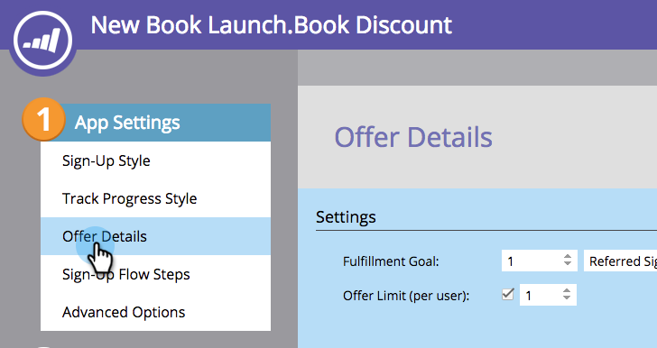
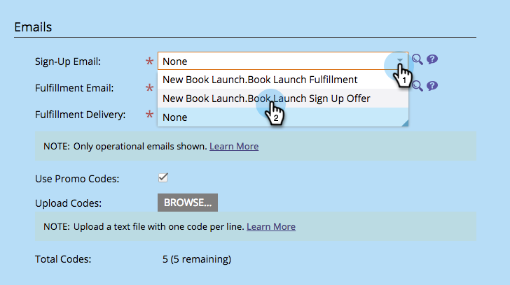

# Enviar mensaje de correo electrónico de cumplimiento de oferta de referencia {#send-referral-offer-fulfillment-email}

Recompense a sus clientes con cupones y códigos de descuento usando el correo electrónico de cumplimiento de ofertas.

>[!PREREQUISITES]
>
>* [Usar correos electrónicos en promociones sociales](/help/marketo/product-docs/demand-generation/social/social-functions/use-emails-in-social-promotions.md)
>* [Creación de una oferta de referencia](/help/marketo/product-docs/demand-generation/social/referral-offers/create-a-referral-offer.md)

## Configurar entrega de cumplimiento {#set-up-fulfillment-delivery}

1. Seleccione la oferta de referente. Haga clic en **Editar borrador**.

   

1. En **Configuración de la aplicación**, seleccione **Detalles de la oferta**.

   

1. Seleccione un **Correo electrónico de registro**.

   

1. Seleccione un **Correo electrónico de cumplimiento**.

   

   >[!NOTE]
   >
   >Más información sobre [uso de correos electrónicos en promociones sociales](/help/marketo/product-docs/demand-generation/social/social-functions/use-emails-in-social-promotions.md).

1. Haga clic en el **Entrega de cumplimiento** y seleccione **segmentación automática**.

   

   El mensaje seleccionado dentro de **Correo electrónico de cumplimiento** se envía automáticamente a las personas que cumplen el objetivo.

## Envío manual {#manual-send}

Puede enviar un correo electrónico de cumplimiento manualmente a una persona una vez que haya alcanzado el objetivo.

1. Seleccione la oferta de referente y haga clic en el botón **Participantes** pestaña .

   

1. Haga clic en el **Filtrar por** y seleccione **Objetivo**.

   >[!NOTE]
   >
   >Esto selecciona a las personas que han alcanzado el objetivo de oferta de referente.

   

1. Seleccione las personas en la vista filtrada.

   

1. Haga clic con el botón derecho y seleccione **Enviar correo electrónico de cumplimiento**.

   

¡Increíble! Esas personas recibirán ahora el correo electrónico de cumplimiento y se sentirán entusiasmadas por su recompensa.
