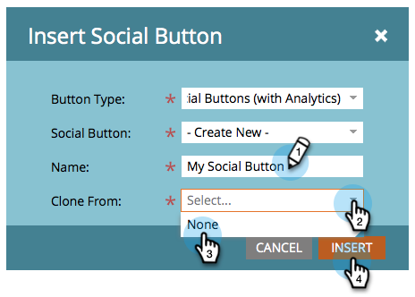

# Agregar un botón de Social en una página de aterrizaje {#add-a-social-button-on-a-landing-page}

Un botón social anima a las personas a compartir su contenido con sus amigos. Colóquelo en las páginas de aterrizaje, Facebook y el sitio web.

>[!AVAILABILITY]
>
>No todos los clientes han adquirido esta funcionalidad. Póngase en contacto con su representante de ventas para obtener más información.

1. Vaya a la página de aterrizaje y haga clic en **Editar borrador**.

   

1. Arrastre el ratón sobre la **Botón Social** de los elementos de la derecha.

   

1. Select **Botones sociales (con Analytics)**.

   

   Una vez que la página de aterrizaje esté activa, consulte la actividad generada por el **Botón Social** (con Analytics) en la [Tablero social](/help/marketo/product-docs/demand-generation/social/social-functions/view-social-performance.md).

   Si agrega un **Botón &quot;Me gusta&quot;/Recomendar (Lite)** en su lugar, consulte el número de difusiones en la variable [informe de rendimiento de la página de aterrizaje](/help/marketo/product-docs/demand-generation/landing-pages/understanding-landing-pages/landing-page-performance-report.md).

1. Select **Crear nuevo** en la lista desplegable .

   >[!NOTE]
   >
   >También puede crear un botón social dentro de un programa seleccionando **Nuevo** > **Nuevo recurso local**.

1. Asigne un nombre al botón social , seleccione **Ninguna** from **Clonar** **De** y haga clic en **Insertar**.

   

¡Felicidades! Ha agregado un botón social a la página de aterrizaje. Asegúrese de aprobar la página de aterrizaje. También puede [publicar la página de aterrizaje en Facebook](/help/marketo/product-docs/demand-generation/facebook/publish-landing-pages-to-facebook.md) o [coloque el botón social en su sitio web](/help/marketo/product-docs/demand-generation/social/social-functions/deploy-social-on-your-website.md).

>[!TIP]
>
>Para ahorrar tiempo, puede usar la variable **Clonar desde** para copiar toda la configuración de un botón social existente.

>[!MORELIKETHIS]
>
>Ya ha terminado, pero puede cambiar la configuración del botón social si es necesario. Comience por [personalización del estilo del botón](/help/marketo/product-docs/demand-generation/social/configuring-social-actions/customize-social-app-button.md) y [edición de mensajes compartidos](/help/marketo/product-docs/demand-generation/social/configuring-social-actions/configure-social-sign-up-share-flow.md) presenta.
