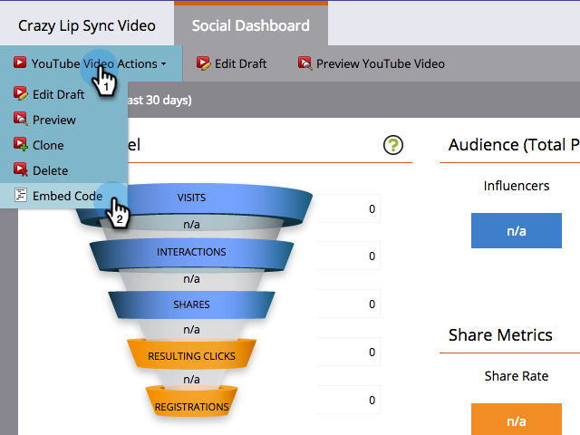
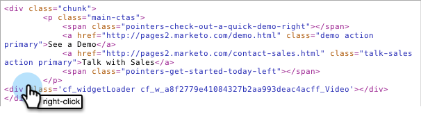

# Implementar Social en el sitio web {#deploy-social-on-your-website}

Incruste aplicaciones sociales en páginas que no sean de Marketo.

>[!AVAILABILITY]
>
>Póngase en contacto con su representante de ventas para obtener más información.

Puede implementar aplicaciones sociales en su propio sitio web para atraer a su audiencia e incluir a todos en la conversación más amplia en las redes sociales. A medida que las personas comparten sus promociones y contenido con sus amigos en las redes sociales, usted genera más tráfico en su sitio.

1. Seleccione una aplicación social aprobada, como un vídeo de YouTube o un botón de Social .

   

1. Select **Código incrustado** de Acciones de aplicación social.

   

1. Copie el código del encabezado de página del sitio (`<head>`) y cuerpo (`<body>`).

   

1. Pegue el primer fragmento de código en el encabezado de página del sitio web.

   

1. Pegue el segundo fragmento de código en cada página, donde desea que aparezca la aplicación social en la página.

   

1. Si necesita establecer el tamaño de la aplicación social en dimensiones específicas de la página, agregue la variable **outsideHeight** y **outsideWidth** al segundo fragmento de código. Por ejemplo, puede añadir `options='{"outerHeight":400, "outerWidth":600}'`, como en:

   

   La aplicación social de Marketo ahora agrega contenido e interactividad al sitio web, lo que invita a seguidores, visitantes y clientes existentes a difundir su información. Al mismo tiempo, agrega sus datos de perfil a la base de datos y realiza un seguimiento de las métricas de influencia social.

   >[!MORELIKETHIS]
   >
   >* [Botón Personalizar aplicación social](/help/marketo/product-docs/demand-generation/social/configuring-social-actions/customize-social-app-button.md)
   >* [Definir el requisito de uso compartido social](/help/marketo/product-docs/demand-generation/social/social-functions/set-social-share-requirement.md)
   >* [Publicar páginas de aterrizaje en Facebook](/help/marketo/product-docs/demand-generation/facebook/publish-landing-pages-to-facebook.md)

