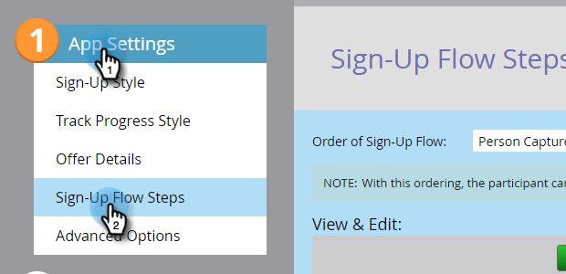

# Establecer requisito de uso compartido social {#set-social-share-requirement}

Cuando usted [crear una oferta de referencia](/help/marketo/product-docs/demand-generation/social/referral-offers/create-a-referral-offer.md), puede requerir que las personas compartan la oferta para registrarse o hacerla opcional.

1. Ir a **Actividades de marketing**.

   

1. Seleccione la oferta de referencia y haga clic en **Editar borrador**.

   

1. En el editor de ofertas de recomendación, vaya a **Configuración de aplicación** y luego **Pasos del flujo de registro**.

   

1. Seleccione el orden del flujo de registro.

   

   * **Captura de persona** > **Compartir**: la persona puede omitir el uso compartido y registrarse.
   * **Compartir** > **Captura de persona**: la persona debe compartir para registrarse.

1. Para cada opción, consulte la vista previa en la **Ver y editar** ventana.

   
