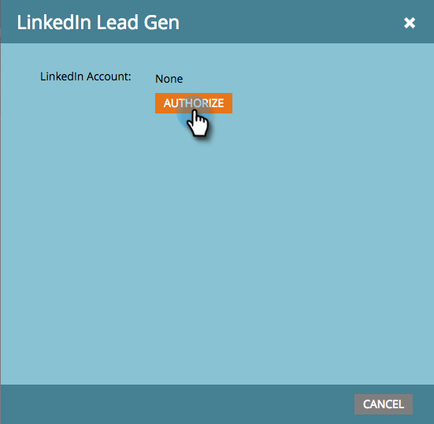

# Configuración de formularios de generación de clientes potenciales de LinkedIn {#set-up-linkedin-lead-gen-forms}

Utilice LinkedIn Lead Gen Forms para ejecutar campañas publicitarias en LinkedIn y generar posibles clientes para Marketo.

>[!NOTE]
>
>* **Se requieren permisos de administrador**
>
>* Al crear formularios de generación de posibles clientes de LinkedIn, asegúrese de que el nombre del formulario no contenga solo caracteres numéricos. El nombre del formulario debe ser alfabético o alfanumérico.
>
>* Un posible cliente de LinkedIn no entrará en Marketo Engage si coincide con un registro de persona existente en Marketo que está asociado con un registro de empresa creado mediante las API de la empresa y la suscripción de Marketo no está conectada a un CRM.

1. Vaya al área de **[!UICONTROL Admin]**.

   

1. Vaya a **[!UICONTROL LaunchPoint]**, haga clic en **[!UICONTROL Nuevo]** y seleccione **[!UICONTROL Nuevo servicio]**.

   

1. Escriba un _Nombre para mostrar_ para su servicio, seleccione el servicio **[!UICONTROL LinkedIn Lead Gen]** del menú desplegable y haga clic en **[!UICONTROL Siguiente]**.

   

1. Marketo abre una nueva ficha en el mismo explorador en [linkedin.com](https://www.linkedin.com){target="_blank"}. Inicie sesión en LinkedIn con la cuenta que desee utilizar para la integración.

   >[!NOTE]
   >
   >La cuenta de LinkedIn necesita tener acceso a todas las cuentas empresariales de LinkedIn para las que está creando campañas patrocinadas.

   

1. Cuando haya iniciado sesión en LinkedIn, vuelva a Marketo y haga clic en **[!UICONTROL Autorizar]**.

   

1. Cuando se le solicite, haga clic en **[!UICONTROL Permitir]** para aceptar la instalación de la aplicación Marketo en LinkedIn.

   

1. Verá que ahora está autorizado. Haga clic en **[!UICONTROL Next]**.

   

   >[!CAUTION]
   >
   >El servicio caduca automáticamente un año después de la autorización. Para recuperar el acceso, simplemente haga clic en **[!UICONTROL Volver a autorizar]**. Es posible que tenga que volver a introducir la contraseña de LinkedIn, según la configuración del explorador.

1. Seleccione las cuentas de las que desea que los posibles clientes de LinkedIn Lead Gen entren en Marketo desde y haga clic en **[!UICONTROL Siguiente]**.

   >[!TIP]
   >
   >Si no ve las cuentas empresariales que espera, asegúrese de que la cuenta de LinkedIn del usuario que se está autorizando tenga permisos de administrador de formularios de generación de clientes potenciales para la cuenta empresarial en LinkedIn.

   

1. Para aceptar las asignaciones predeterminadas de campos de LinkedIn a Marketo, simplemente haga clic en **[!UICONTROL Crear]**. Si desea cambiar la asignación de campo predeterminada, quitar una asignación de campo o agregar una nueva asignación de campo, puede hacerlo por campo a través del modal siguiente.

   >[!CAUTION]
   >
   >Marketo admite la asignación de dos campos de LinkedIn a un único campo de Marketo, _pero solo cuando_ los dos campos de LinkedIn no están en el mismo formulario. Si asigna dos campos del mismo formulario de LinkedIn a un único campo de Marketo, es posible que no se pueda introducir la base de datos de Marketo.

   

   >[!NOTE]
   >
   >Solo los campos de LinkedIn que ya se hayan guardado en una [plantilla de formulario](https://www.linkedin.com/help/lms/answer/79634){target="_blank"} en el Administrador de LinkedIn Campaign se mostrarán como campos de LinkedIn que se pueden asignar a campos de Marketo.

   

¡Bien hecho! Las personas que envíen formularios de generación de posibles clientes de LinkedIn empezarán a fluir a Marketo a medida que ejecute campañas exitosas en LinkedIn.

>[!NOTE]
>
>Solo puede autorizar una sola cuenta de usuario de LinkedIn. Si tiene varias cuentas empresariales que desea vincular a Marketo, asegúrese de que la cuenta de LinkedIn del usuario que se está autorizando tenga permisos de administrador de formularios de generación de clientes potenciales para la cuenta empresarial en LinkedIn.

>[!MORELIKETHIS]
>
>[Usar filtros y Déclencheur de formulario de generación de clientes potenciales de LinkedIn en una campaña inteligente](/help/marketo/product-docs/demand-generation/social/social-functions/use-linkedin-lead-gen-form-filters-and-triggers-in-a-smart-campaign.md){target="_blank"}
