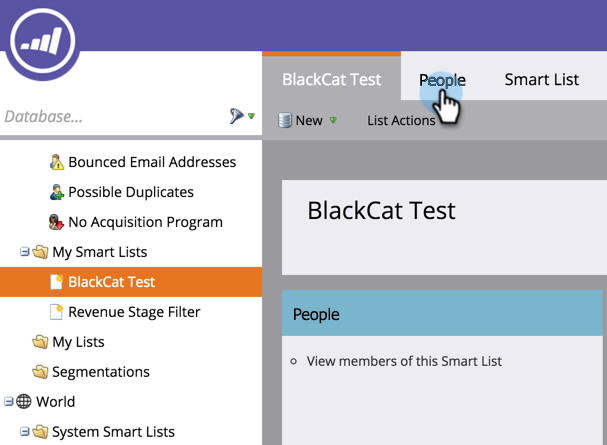

# Usar una lista de Marketo o una lista inteligente como segmento de audiencia de LinkedIn {#use-a-marketo-list-or-smart-list-as-a-linkedin-audience-segment}

Integre a sus usuarios de Marketo con las audiencias de LinkedIn.

>[!PREREQUISITES]
>
>[Añadir audiencias coincidentes de LinkedIn como un servicio de LaunchPoint](/help/marketo/product-docs/demand-generation/ad-network-integrations/add-linkedin-matched-audiences-as-a-launchpoint-service.md)

1. Vaya a la **Base de datos**.

   

1. Seleccione una lista inteligente.

   

1. Haga clic en el **People** pestaña .

   

1. Haga clic en el **Enviar mediante puente publicitario** icono  en la parte inferior de la lista.

   

   >[!NOTE]
   >
   >Al utilizar integraciones de red de publicidad para enviar una audiencia a LinkedIn, Marketo solo envía la dirección de correo electrónico.

1. Select **linkedIn** y haga clic en **Siguiente**.

   

1. Seleccione un **Audiencia de linkedIn**.

   >[!NOTE]
   >
   >Hacer clic **+Nueva audiencia** creará una audiencia en LinkedIn Campaign Manager.

   

   >[!NOTE]
   >
   >linkedIn dejó de utilizar las API utilizadas para el tipo de notificación push &quot;Borrar audiencia y añadir posibles clientes&quot; en marzo de 2018. Esta opción ya no está disponible a partir de la versión del primer trimestre de 2018 de Marketo.

1. Seleccione un **Tipo de push**. Haga clic en **Actualizar**.

   

   >[!NOTE]
   >
   >Espere 15 minutos para que se produzca la sincronización.

¡Los cinco! Los datos ahora se combinarán con las audiencias de LinkedIn. Para obtener información sobre cómo cargar listas en LinkedIn para la segmentación de cuentas y contactos, visite [Centro de ayuda de Soluciones de marketing de linkedIn](https://www.linkedin.com/help/lms/answer/73938?query=ad%20segment).
