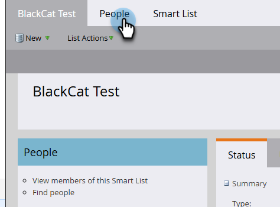

# Uso de una lista de Marketo o una lista inteligente como segmento de audiencia de LinkedIn {#use-a-marketo-list-or-smart-list-as-a-linkedin-audience-segment}

Integre a sus empleados de Marketo Engage con sus audiencias de LinkedIn.

>[!PREREQUISITES]
>
>[Agregar audiencias coincidentes de LinkedIn como servicio de LaunchPoint](/help/marketo/product-docs/demand-generation/ad-network-integrations/add-linkedin-matched-audiences-as-a-launchpoint-service.md){target="_blank"}

1. Ir a **[!UICONTROL Base de datos]**.

   

1. Seleccione una lista inteligente.

   

1. Haga clic en la ficha **[!UICONTROL Personas]**.

   

1. Haga clic en el icono _Enviar mediante Ad Bridge_  en la parte inferior de la lista.

   

   >[!NOTE]
   >
   >Cuando se utilizan integraciones de red de anuncios para enviar una audiencia a LinkedIn, Marketo solo envía la dirección de correo electrónico.

1. Seleccione **[!UICONTROL LinkedIn]** y haga clic en **[!UICONTROL Siguiente]**.

   

1. Seleccione una _audiencia de LinkedIn_.

   >[!NOTE]
   >
   >Al hacer clic en **[!UICONTROL +Nueva audiencia]**, se creará una audiencia en el Administrador de campañas de LinkedIn.

   

   >[!NOTE]
   >
   >LinkedIn dejó de utilizar las API para el tipo de inserción &quot;Borrar audiencia y añadir posibles clientes&quot; en marzo de 2018. Esta opción ya no está disponible a partir de la versión del primer trimestre de 2018 de Marketo.

1. Seleccione un _[!UICONTROL tipo push]_. Haga clic en **[!UICONTROL Actualizar]**.

   

   >[!NOTE]
   >
   >Espere 15 minutos para que se realice la sincronización.

¡Choca esos cinco! Sus datos ahora coincidirán con las audiencias de LinkedIn. Para obtener información sobre cómo cargar listas en LinkedIn para segmentación de cuentas y contactos, visite el [centro de ayuda de soluciones de marketing de LinkedIn](https://www.linkedin.com/help/lms/answer/73938?query=ad%20segment){target="_blank"}.
