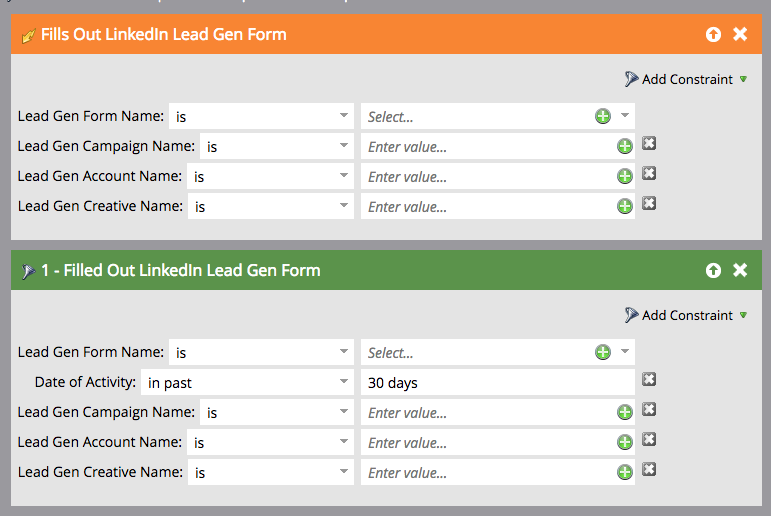

# Uso de filtros y activadores de formulario de generación de posibles clientes de LinkedIn en una campaña inteligente {#use-linkedin-lead-gen-form-filters-and-triggers-in-a-smart-campaign}

Cuando haya habilitado LinkedIn Lead Gen Forms, podrá utilizarlas como filtros y déclencheur en sus campañas inteligentes.

>[!NOTE]
>
>Cuando las personas envían su información en un formulario de generación de clientes potenciales de LinkedIn, esa información se envía a Marketo inmediatamente, lo que hace que el formulario esté disponible en la lista desplegable Nombre del formulario de generación de clientes potenciales. Los nombres de los formularios no serán visibles hasta que al menos una persona haya enviado el formulario.

1. Use el déclencheur **[!UICONTROL Rellena el formulario de generación de clientes potenciales de LinkedIn]** para tomar medidas inmediatamente o el filtro **[!UICONTROL Relleno del formulario de generación de clientes potenciales de LinkedIn]** para campañas por lotes programadas o filtrado de listas inteligentes estándar.

   

1. Añada restricciones para restringir aún más los resultados.

   
