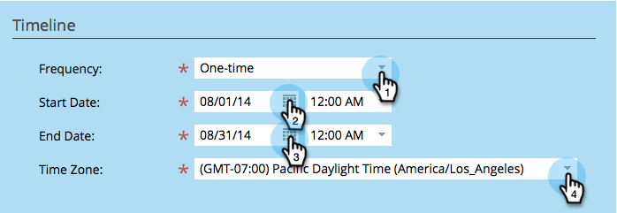
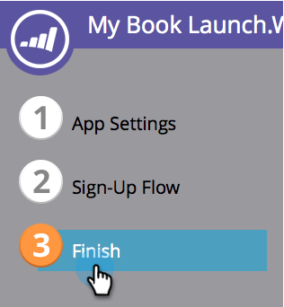

# Crear sorteos {#create-sweepstakes}

Un sorteo le da a la gente la oportunidad de ganar un premio a cambio de contarle a sus amigos acerca de ti. Puede colocarlo en páginas de aterrizaje, sitios web e incluso Facebook.

>[!IMPORTANT]
>
>El 31 de julio de 2024, empezamos el proceso de dejar de utilizar esta función. Ya no se pueden crear nuevos recursos. Los recursos existentes seguirán funcionando hasta el 31 de enero de 2025. [Más información](https://nation.marketo.com/t5/employee-blogs/marketo-engage-social-features-deprecation/ba-p/351977){target="_blank"}

>[!AVAILABILITY]
>
>No todos los usuarios de Marketo Engage han adquirido esta funcionalidad. Póngase en contacto con el equipo de cuenta de Adobe (su administrador de cuentas) para obtener más información.

1. Dentro de su programa, seleccione **Nuevo** > **Nuevo recurso local**.

   

1. En la Galería de recursos locales, haga clic en **Sorteos**.

   

1. Nombra tus sorteos.

   

   >[!TIP]
   >
   >Para ahorrar tiempo, puede usar la opción **Clonar a partir de** para copiar toda la configuración de un sorteo existente.

   El editor de sorteos se abre en una nueva ventana. La configuración predeterminada es correcta, pero aún debe configurar algunos detalles. Le mostraremos cómo hacerlo en los siguientes pasos.

1. Haz clic en **Detalles de sorteos**.

   

1. Seleccione la frecuencia, las fechas de inicio y finalización y la zona horaria.

   

   >[!NOTE]
   >
   >Para los dibujos diarios y semanales, las horas de inicio y finalización se fijan a las 12:00 y a las 23:59, respectivamente. Para un dibujo único, puede elegir sus propias horas de inicio y finalización.

1. Haga clic en **Opciones avanzadas**.

   

1. Añade un enlace a las reglas de tus sorteos. Introduzca la dirección URL. Este vínculo es obligatorio.

   

   El vínculo aparece en la parte inferior de las pantallas de mensajes compartidos.

   >[!NOTE]
   >
   >En esta pantalla, también puede añadir un vínculo de política de privacidad. Ver [Agregar su política de privacidad a una aplicación social](/help/marketo/product-docs/demand-generation/social/social-functions/add-your-privacy-policy-to-a-social-app.md).

1. Haga clic en **Finalizar**.

   

1. Haga clic en **Aprobar y cerrar**.

   

   >[!TIP]
   >
   >Para cambiar cualquiera de los valores predeterminados en tus sorteos, haz clic en **Atrás**. Para guardar tu trabajo para más tarde sin aprobarlo, haz clic en **Cerrar**.

Si hay algún problema en el sorteo, se le pedirá que lo resuelva antes de que se apruebe el sorteo.

¡Felicidades! Ha creado un sorteo.

>[!MORELIKETHIS]
>
>El siguiente paso es [publicar tus sorteos](/help/marketo/product-docs/demand-generation/social/sweepstakes/publish-a-sweepstakes.md), pero puedes cambiar el aspecto y la configuración de tus sorteos. Empiece por [personalizar los estilos de los sorteos](/help/marketo/product-docs/demand-generation/social/sweepstakes/customize-sweepstakes-styles.md).
