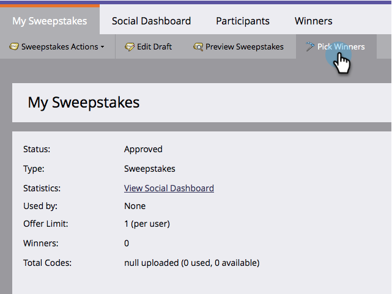
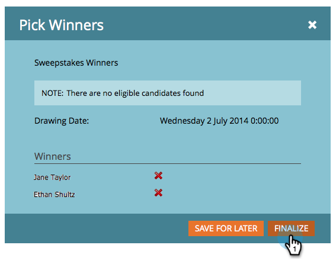

# Seleccione los ganadores de apuestas {#select-sweepstakes-winners}

Cuando [publicar una apuesta](/help/marketo/product-docs/demand-generation/social/sweepstakes/publish-a-sweepstakes.md), debe seleccionar los ganadores de cada dibujo. Cuando lo haga, su [correo electrónico de cumplimiento](/help/marketo/product-docs/demand-generation/social/social-functions/use-emails-in-social-promotions.md) se envía automáticamente a ellos.

>[!AVAILABILITY]
>
>No todos los clientes han adquirido esta funcionalidad. Póngase en contacto con su representante de ventas para obtener más información.

1. Vaya a **Actividades de marketing**.

   

1. Seleccione sus apuestas.

   

1. Haga clic en **Elegir ganadores**.

   

   >[!TIP]
   >
   >Para ver una lista de las personas que se han suscrito a sus apuestas, haga clic en el botón **Participantes** pestaña .

1. Elija el número de ganadores, seleccione **Estoy listo para elegir** y haga clic en **Siguiente**.

   

   >[!NOTE]
   >
   >Si elige 0 ganadores para un dibujo en particular, esa información no se muestra en la variable **Ganadores** pestaña .

1. Haga clic en **Finalizar** para enviar la variable [correo electrónico de cumplimiento](/help/marketo/product-docs/demand-generation/social/referral-offers/send-referral-offer-fulfillment-email.md) a los ganadores de la lista.

   

   >[!NOTE]
   >
   >Puede descalificar a los ganadores antes de hacer clic en Finalizar. Si lo haces, aún son elegibles para otros dibujos en estas apuestas.

¡Felicidades! Ha completado esta ejecución de su oferta de apuestas, ha seleccionado a los ganadores aleatorios y les ha enviado notificaciones por correo electrónico.
