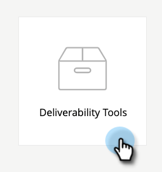

# Paquete de herramientas para la entregabilidad del correo electrónico: Cómo importar una lista semilla {#email-deliverability-power-pack-how-to-import-a-seed-list}

Una lista semilla es una lista de cuentas de correo electrónico en varios proveedores de buzones de correo, incluidas aplicaciones de Google, Hotmail, Yahoo!, etc., que se utilizan para aproximar la tasa de entrega de la bandeja de entrada en comparación con la de las carpetas de correo no deseado. A continuación se indican los pasos para incluir esa lista en la instancia de Marketo Engage.

>[!IMPORTANT]
>
>Este artículo es para aquellos con una suscripción activa al Everest en este momento. Si usa el rastreador de bandeja de entrada por pájaro (anteriormente MessageBird), sus tutoriales [se pueden encontrar aquí](/help/marketo/product-docs/email-marketing/deliverability/inbox-tracker/inbox-tracker-tutorials.md){target="_blank"}.

## Importación de una lista semilla {#import-a-seed-list}

1. En Mi Marketo, seleccione **[!UICONTROL Herramientas de entrega]**.

   

1. Se abrirá la aplicación [!DNL Everest]. En la barra de navegación izquierda, haga clic en **[!UICONTROL En vuelo]** y seleccione **[!UICONTROL Ubicación de la bandeja de entrada]**.

   

1. Haga clic en la ficha **[!UICONTROL Administrar lista semilla]**.

   

1. Haga clic en el menú desplegable **[!UICONTROL Acciones]** y seleccione **[!UICONTROL Descargar: Uno por línea]**.

   

   >[!NOTE]
   >
   >Use el Optimizador de listas semilla (en la parte superior de la página) si quiere que [!DNL Everest] optimice la lista por usted.

1. Después de la exportación, la lista aparecerá como un archivo .txt en la carpeta de descargas del explorador. Revíselo y [impórtelo](/help/marketo/getting-started/quick-wins/import-a-list-of-people.md) a su instancia de Marketo como una lista estática.

   

   >[!TIP]
   >
   >Asegúrese de asignar un nombre a la lista que facilite su búsqueda.

   >[!CAUTION]
   >
   >Recibe una cantidad limitada de estas campañas de colocación de la bandeja de entrada al mes. Para ver cuántos recibes, consulta la sección [!UICONTROL Suscripción] en [!UICONTROL Configuración de la cuenta] > [!UICONTROL Suscripción] en [!DNL Everest]. Para obtener más información, póngase en contacto con su representante de ventas de Marketo.

## Adquisición de nuevas listas de semillas {#acquiring-new-seedlists}

La lista de semillas puede cambiar con tanta frecuencia como cada mes. Es importante iniciar sesión en el paquete de energía de entrega de correo electrónico regularmente y comprobar el estado de la lista de semillas. Cuando se añaden nuevas direcciones o se requiere una actualización por su parte, se le avisará mediante el icono de notificación en la parte inferior izquierda de la aplicación.

Una vez creada la lista estática en Marketo, puede empezar a enviarla para probar la ubicación de la bandeja de entrada del correo electrónico.
