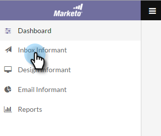

# Power Pack de capacidad de entrega de correo electrónico: Cómo importar una lista de elementos secundarios {#email-deliverability-power-pack-how-to-import-a-seedlist}

Una lista de fuentes es una lista de cuentas de correo electrónico de varios proveedores de buzones de correo, incluidas las aplicaciones de Google, Hotmail, Yahoo!, etc., que se utilizan para aproximar la tasa de entrega de la bandeja de entrada frente a la de las carpetas de correo no deseado. A continuación se muestra cómo obtener esa lista en la instancia de Marketo.

>[!AVAILABILITY]
>
>No todos los clientes han adquirido esta funcionalidad. Póngase en contacto con su representante de ventas para obtener más información.

## Importar una lista de elementos semilla {#import-a-seedlist}

1. En Mi Marketo, seleccione **Herramientas de entrega**.

   

1. Haga clic en **Informador de la bandeja de entrada**.

   

1. Haga clic en **Obtener lista de fuentes**.

   

1. Haga clic en **Lista de exportación**.

   

   >[!NOTE]
   >
   >Choose **Lista de optimización** si quieres 250ok para [optimizar la lista](https://help.returnpath.com/hc/en-us/articles/360046746451-What-is-250ok-s-seedlist-optimizer-and-why-should-I-use-it-) para usted. Choose **Personalizar lista** si desea seleccionar las regiones de la lista de semillas que desea incluir.

1. Después de la exportación, la lista aparecerá como archivo .txt en la carpeta de descargas del explorador. Recupere y [importar](/help/marketo/getting-started/quick-wins/import-a-list-of-people.md) en la instancia de Marketo como una lista estática.

   

   >[!TIP]
   >
   >Asegúrese de nombrar la lista de una manera que facilite su búsqueda.

   >[!CAUTION]
   >
   >Recibe una cantidad limitada de estas campañas del Informador de la bandeja de entrada por mes. Para ver cuántos obtienes, mira en tu 250ok **Configuración de la cuenta**. Para obtener más información, póngase en contacto con su representante de ventas de Marketo.

## Adquisición de nuevas listas de semillas {#acquiring-new-seedlists}

La lista de semillas puede cambiar con la misma frecuencia que cada mes. Es importante iniciar sesión en Email Deliverabilty Power Pack regularmente y comprobar el estado de la lista de fuentes. Cuando se agregan direcciones nuevas o se requiere una actualización en el extremo, se le avisará a través de la interfaz en la página Obtener lista de direcciones .

Una vez creada la lista estática en Marketo, puede empezar a enviarla para probar la ubicación de la bandeja de entrada del correo electrónico.
